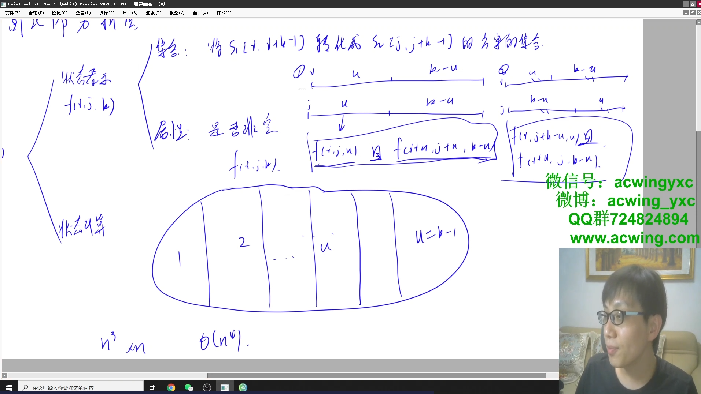

# 87. 扰乱字符串

## 题目描述

使用下面描述的算法可以扰乱字符串 s 得到字符串 t ：

1. 如果字符串的长度为 1 ，算法停止
2. 如果字符串的长度 > 1 ，执行下述步骤：
   1. 在一个随机下标处将字符串分割成两个非空的子字符串。即，如果已知字符串 s ，则可以将其分成两个子字符串 x 和 y ，且满足 s = x + y 。
   2. 随机 决定是要「交换两个子字符串」还是要「保持这两个子字符串的顺序不变」。即，在执行这一步骤之后，s 可能是 s = x + y 或者 s = y + x 。
   3. 在 x 和 y 这两个子字符串上继续从步骤 1 开始递归执行此算法。

给你两个 长度相等 的字符串 s1 和 s2，判断 s2 是否是 s1 的扰乱字符串。如果是，返回 true ；否则，返回 false 。


```r
示例 1：

输入：s1 = "great", s2 = "rgeat"
输出：true
解释：s1 上可能发生的一种情形是：
"great" --> "gr/eat" // 在一个随机下标处分割得到两个子字符串
"gr/eat" --> "gr/eat" // 随机决定：「保持这两个子字符串的顺序不变」
"gr/eat" --> "g/r / e/at" // 在子字符串上递归执行此算法。两个子字符串分别在随机下标处进行一轮分割
"g/r / e/at" --> "r/g / e/at" // 随机决定：第一组「交换两个子字符串」，第二组「保持这两个子字符串的顺序不变」
"r/g / e/at" --> "r/g / e/ a/t" // 继续递归执行此算法，将 "at" 分割得到 "a/t"
"r/g / e/ a/t" --> "r/g / e/ a/t" // 随机决定：「保持这两个子字符串的顺序不变」
算法终止，结果字符串和 s2 相同，都是 "rgeat"
这是一种能够扰乱 s1 得到 s2 的情形，可以认为 s2 是 s1 的扰乱字符串，返回 true

示例 2：

输入：s1 = "abcde", s2 = "caebd"
输出：false

示例 3：

输入：s1 = "a", s2 = "a"
输出：true
```

提示：

- s1.length == s2.length
- 1 <= s1.length <= 30
- s1 和 s2 由小写英文字母组成

链接：https://leetcode-cn.com/problems/scramble-string

## 代码

yxc讲解



```java
class Solution {
    public boolean isScramble(String s1, String s2) {
        if(s1.length() != s2.length()) return false;
        int n = s1.length();
        // f[i][j][k]
        // 状态表示：s1[i, i + k - 1] 转化为 s2[j, j + k - 1] 的所有方案的集合
        // 属性：是否非空
        // 状态计算：
        boolean[][][] f = new boolean[n + 10][n + 10][n + 10];
        for(int k = 1; k <= n; k++) {
            for(int i = 0; i + k - 1 < n; i++) {
                for(int j = 0; j + k - 1 < n; j++) {
                    if(k == 1) {
                        if(s1.charAt(i) == s2.charAt(j)) f[i][j][k] = true;
                    }
                    else {
                        for(int u = 1; u < k; u++) {
                            if((f[i][j][u] && f[i + u][j + u][k - u]) || (f[i][j + k - u][u] && f[i + u][j][k - u])){
                                f[i][j][k] = true;
                                break;
                            }
                        }
                    }
                }
            }
        }
        return f[0][0][n];
    }
}
```