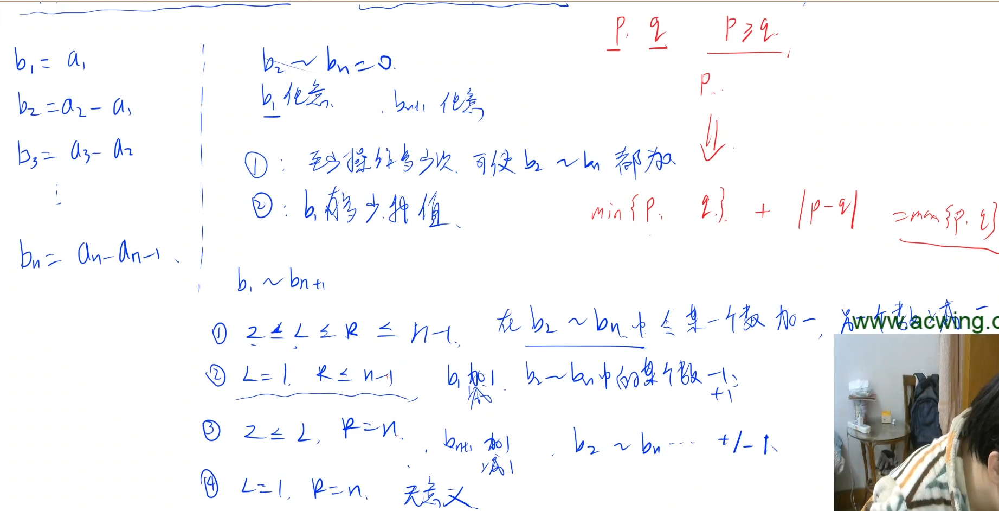

# 1. 前缀和

# 2. 差分

## [995. K 连续位的最小翻转次数](https://leetcode-cn.com/problems/minimum-number-of-k-consecutive-bit-flips/)

在仅包含 0 和 1 的数组 A 中，一次 K 位翻转包括选择一个长度为 K 的（连续）子数组，同时将子数组中的每个 0 更改为 1，而每个 1 更改为 0。

返回所需的 K 位翻转的最小次数，以便数组没有值为 0 的元素。如果不可能，返回 -1。

```R
示例 1：

输入：A = [0,1,0], K = 1
输出：2
解释：先翻转 A[0]，然后翻转 A[2]。

示例 2：

输入：A = [1,1,0], K = 2
输出：-1
解释：无论我们怎样翻转大小为 2 的子数组，我们都不能使数组变为 [1,1,1]。

示例 3：

输入：A = [0,0,0,1,0,1,1,0], K = 3
输出：3
解释：
翻转 A[0],A[1],A[2]: A变成 [1,1,1,1,0,1,1,0]
翻转 A[4],A[5],A[6]: A变成 [1,1,1,1,1,0,0,0]
翻转 A[5],A[6],A[7]: A变成 [1,1,1,1,1,1,1,1]
```

**提示：**

- 1 <= A.length <= 30000
- 1 <= K <= A.length

来源：力扣（LeetCode）
链接：https://leetcode-cn.com/problems/minimum-number-of-k-consecutive-bit-flips
著作权归领扣网络所有。商业转载请联系官方授权，非商业转载请注明出处。

**解答**

```java
class Solution {
    public int minKBitFlips(int[] a, int k) {
        int n = a.length;
        int[] b = new int[n + 10];
        int res = 0;
        // sum 保存前缀和
        int sum = 0;
        for(int i = 0; i < n; i++) {
            sum = sum + b[i];
            if((a[i] + sum) % 2 == 0) {
                if(i + k > n) return -1;
                // b[i] += 1;
                sum++;
                b[i + k] -= 1;
                res++;
            }
        }
        return res;
    }
}
```


## [1674. 使数组互补的最少操作次数](https://leetcode-cn.com/problems/minimum-moves-to-make-array-complementary/)

**题目描述**

给你一个长度为 偶数 n 的整数数组 nums 和一个整数 limit 。每一次操作，你可以将 nums 中的任何整数替换为 1 到 limit 之间的另一个整数。

如果对于所有下标 i（下标从 0 开始），nums[i] + nums[n - 1 - i] 都等于同一个数，则数组 nums 是 互补的 。例如，数组 [1,2,3,4] 是互补的，因为对于所有下标 i ，nums[i] + nums[n - 1 - i] = 5 。

返回使数组 互补 的 最少 操作次数。


```r
示例 1：

输入：nums = [1,2,4,3], limit = 4
输出：1
解释：经过 1 次操作，你可以将数组 nums 变成 [1,2,2,3]（加粗元素是变更的数字）：
nums[0] + nums[3] = 1 + 3 = 4.
nums[1] + nums[2] = 2 + 2 = 4.
nums[2] + nums[1] = 2 + 2 = 4.
nums[3] + nums[0] = 3 + 1 = 4.
对于每个 i ，nums[i] + nums[n-1-i] = 4 ，所以 nums 是互补的。

示例 2：

输入：nums = [1,2,2,1], limit = 2
输出：2
解释：经过 2 次操作，你可以将数组 nums 变成 [2,2,2,2] 。你不能将任何数字变更为 3 ，因为 3 > limit 。

示例 3：

输入：nums = [1,2,1,2], limit = 2
输出：0
解释：nums 已经是互补的。
```


提示：

    n == nums.length
    2 <= n <= 105
    1 <= nums[i] <= limit <= 105
    n 是偶数。

来源：力扣（LeetCode）
链接：https://leetcode-cn.com/problems/minimum-moves-to-make-array-complementary
著作权归领扣网络所有。商业转载请联系官方授权，非商业转载请注明出处。

**解答**

nlogn 的复杂度

nums[i] + nums[n - 1 - i] 可以取 2 ~ 2 * limit 等于多少合适呢？

想法是遍历一遍

但是遍历一遍的复杂度是 n^2，会超时

所以想办法让复杂度降低

考虑 nums[i] + nums[n - 1 - i] 的和在哪些范围，需要操作的次数，这样可以打包处理。

某个范围同加同减，可以想到差分数组

先假设 2 ~ 2 * limit 操作两次

min(a, b) + 1 ~ max(a, b) + limit 可以少操作一次

a + b 可以不用操作

遍历不同 和 的情况下的操作次数

差分数组的前缀和数字就是不同 和 情况下的操作次数，取个最小值。

```java
class Solution {
    public int minMoves(int[] nums, int limit) {
        int n = nums.length;
        // 差分数组
        int[] d = new int[2 * limit + 2];
        // 前缀和数组
        int[] s = new int[2 * limit];
        for(int i = 0; i < n / 2; i ++){
            int a = Math.min(nums[i], nums[n - 1 - i]);
            int b = Math.max(nums[i], nums[n - 1 - i]);
            int t = nums[i] + nums[n - 1 - i];
            insert(d, 2, 2 * limit, 2);
            insert(d, a + 1, b + limit, -1);
            insert(d, t, t, -1);
        }
        int res = n;
        int t = 0;
        for(int i = 2; i <= 2 * limit; i++){
            t += d[i];
            res = Math.min(t, res);
        }
        return res;
    }
    public void insert(int[] d, int l, int r, int c){
        d[l] += c;
        d[r + 1] -= c;
    }
}
```

## 100 增减序列    

**题目描述**

给定一个长度为 *n* 的数列 `a1,a2,…,an`，每次可以选择一个区间 [l,r]，使下标在这个区间内的数都加一或者都减一。

求至少需要多少次操作才能使数列中的所有数都一样，并求出在保证最少次数的前提下，最终得到的数列可能有多少种。

**输入格式**

第一行输入正整数 `n`。

接下来 `n`行，每行输入一个整数，第i+1行的整数代表`ai`。

**输出格式**

第一行输出最少操作次数。

第二行输出最终能得到多少种结果。

**数据范围**

$0<n≤10^5,$
$0≤a_i<2147483648$

**输入样例：**

```R
4
1
1
2
2
```

**输出样例：**

```R
1
2
```

来源：AcWing
链接：https://www.acwing.com/problem/content/102/

**解答**

```java
import java.io.*;
public class Main {

    public static void main(String[] args) throws IOException {
        BufferedReader br = new BufferedReader(new InputStreamReader(System.in));
        int n = Integer.parseInt(br.readLine());
        int[] a = new int[n + 1];
        int[] b = new int[n + 2];
        // 构造差分数组
        for(int i = 1; i <= n; i++) {
            a[i] = Integer.parseInt(br.readLine());
            b[i] = a[i] - a[i - 1];
        }
        long p = 0;//b2-bn正数总和
        long q = 0;//b2-bn负数总和
        //要让b2到bn全部变成0
        //每次取一个正的，一个负的比较好
        //再多出来的再单独算
        for(int i = 2; i <= n; i++) {
            if(b[i] > 0) {
                p += b[i];//正数
            }else {
                q -= b[i];//因为b[i]是负的
            }
        }
        System.out.println(Math.max(p, q));
        System.out.println(Math.abs(p - q) + 1);
    }
}
```

**yxc**




```cpp
#include <cstdio>
#include <cstring>
#include <iostream>
#include <algorithm>

using namespace std;

const int N = 100010;

typedef long long LL;

int n;
int a[N], b[N];

int main()
{
    scanf("%d", &n);
    for (int i = 1; i <= n; i ++ ) scanf("%d", &a[i]);
    for (int i = 1; i <= n; i ++ ) b[i] = a[i] - a[i - 1];

    LL p = 0, q = 0;
    for (int i = 2; i <= n; i ++ )
        if (b[i] > 0) p += b[i];
        else q -= b[i];

    cout << max(p, q) << endl;
    cout << abs(p - q) + 1 << endl;

    return 0;
}

作者：yxc
链接：https://www.acwing.com/activity/content/code/content/203971/
来源：AcWing
著作权归作者所有。商业转载请联系作者获得授权，非商业转载请注明出处。
```

