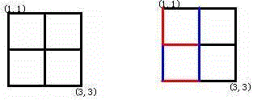
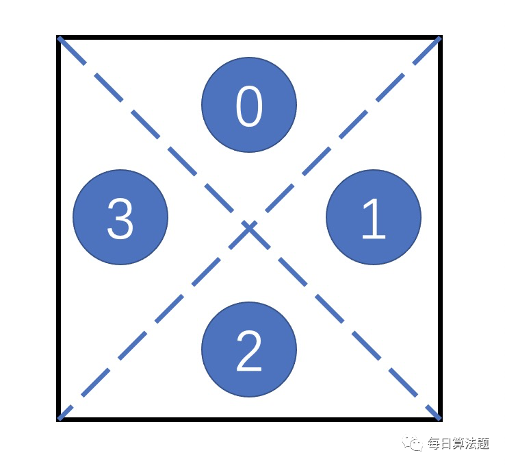

# 并查集

## 基础知识

**并查集的操作：**

1. 将两个集合合并
2. 询问两个元素是否在一个集合当中

近乎O(1)的时间复杂度

**基本原理**：每个集合用一颗树来表示。树根的编号就是整个集合的编号。每个节点储存它的父节点，p[x]表示x的父节点

1. 如何判断树根？p[x] == x
2. 如何求x的集合编号：`while(p[x] != x) x = p[x];`
3. 如何合并两个集合？假设px是x的集合编号，py是y的集合编号，`p[x] = py`

## 模板

(1)朴素并查集：

```java
    int p[N]; //存储每个点的祖宗节点

    // 返回x的祖宗节点
    int find(int x)
    {
        if (p[x] != x) p[x] = find(p[x]);
        return p[x];
    }

    // 初始化，假定节点编号是1~n
    for (int i = 1; i <= n; i ++ ) p[i] = i;

    // 合并a和b所在的两个集合：
    p[find(a)] = find(b);
```

(2)维护size的并查集：

```java
  int p[N], size[N];
    //p[]存储每个点的祖宗节点, size[]只有祖宗节点的有意义，表示祖宗节点所在集合中的点的数量
    // 返回x的祖宗节点
    int find(int x)
    {
        if (p[x] != x) p[x] = find(p[x]);
        return p[x];
    }

    // 初始化，假定节点编号是1~n
    for (int i = 1; i <= n; i ++ )
    {
        p[i] = i;
        size[i] = 1;
    }

    // 合并a和b所在的两个集合：
    size[find(b)] += size[find(a)];
    p[find(a)] = find(b);
```

(3)维护到祖宗节点距离的并查集：

```java
    int p[N], d[N];
    //p[]存储每个点的祖宗节点, d[x]存储x到p[x]的距离

    // 返回x的祖宗节点
    int find(int x)
    {
        if (p[x] != x)
        {
            int u = find(p[x]);
            d[x] += d[p[x]];
            p[x] = u;
        }
        return p[x];
    }

    // 初始化，假定节点编号是1~n
    for (int i = 1; i <= n; i ++ )
    {
        p[i] = i;
        d[i] = 0;
    }

    // 合并a和b所在的两个集合：
    p[find(a)] = find(b);
    d[find(a)] = distance; // 根据具体问题，初始化find(a)的偏移量
```


## AcWing 836. 合并集合

一共有n个数，编号是1~n，最开始每个数各自在一个集合中。

现在要进行m个操作，操作共有两种：

1. “M a b”，将编号为a和b的两个数所在的集合合并，如果两个数已经在同一个集合中，则忽略这个操作；
2. “Q a b”，询问编号为a和b的两个数是否在同一个集合中；

**Solution**

```java
import java.util.*;
import java.io.*;

public class Main{
    private static int N = 100010;//存储每个点的祖宗节点
    private static int[] p = new int[N];
    private static int find(int x){
        if(p[x] != x){//不是祖宗节点的话
            p[x] = find(p[x]);
        }
        return p[x];
    }
    public static void main(String[] args) throws IOException{
        BufferedReader br = new BufferedReader(new InputStreamReader(System.in));
        String[] str = br.readLine().split(" ");
        int n =  Integer.parseInt(str[0]);
        int m = Integer.parseInt(str[1]);
        //初始化
        for(int i = 1; i <= n; i++){
            p[i] = i;//每个数自己一个集合，也就是每个数的祖宗节点都是自己
        }
        while(m-- > 0){
            str = br.readLine().split(" ");
            if(str[0].equals("M")){
                int a = Integer.parseInt(str[1]);
                int b = Integer.parseInt(str[2]);
                p[find(a)] = find(b);
            }else{
                int a = Integer.parseInt(str[1]);
                int b = Integer.parseInt(str[2]);
                if(find(a) == find(b)){
                    System.out.println("Yes");
                }else{
                    System.out.println("No");
                }
            }
        }
        br.close();
    }
}
```

## AcWing 837. 连通块中点的数量

给定一个包含n个点（编号为1~n）的无向图，初始时图中没有边。

现在要进行m个操作，操作共有三种：

1. “C a b”，在点a和点b之间连一条边，a和b可能相等；
2. “Q1 a b”，询问点a和点b是否在同一个连通块中，a和b可能相等；
3. “Q2 a”，询问点a所在连通块中点的数量；

**Solution**

```java
import java.io.*;

public class Main{
    private static int N = 100010;//存储每个点的祖宗节点
    private static int[] p = new int[N];
    private static int[] size = new int[N];
    private static int find(int x){
        if(p[x] != x){//不是祖宗节点的话
            p[x] = find(p[x]);//路径压缩
        }
        return p[x];
    }
    public static void main(String[] args) throws IOException{
        BufferedReader br = new BufferedReader(new InputStreamReader(System.in));
        String[] str = br.readLine().split(" ");
        int n =  Integer.parseInt(str[0]);
        int m = Integer.parseInt(str[1]);
        //初始化
        for(int i = 1; i <= n; i++){
            p[i] = i;//每个数自己一个集合，也就是每个数的祖宗节点都是自己
            size[i] = 1;
        }
        while(m-- > 0){
            str = br.readLine().split(" ");
            if(str[0].equals("C")){
                int a = Integer.parseInt(str[1]);
                int b = Integer.parseInt(str[2]);
                int pa = find(a);
                int pb = find(b);
                if(pa != pb) {
                    //合并a b所在集合
                    p[pa] = pb;
                    size[pb] += size[pa];
                }
            }else if(str[0].equals("Q1")){
                int a = Integer.parseInt(str[1]);
                int b = Integer.parseInt(str[2]);
                if(find(a) == find(b)){
                    System.out.println("Yes");
                }else{
                    System.out.println("No");
                }
            }else{
                int x = Integer.parseInt(str[1]);
                System.out.println(size[find(x)]);
            }
        }
        br.close();
    }
}
```

## AcWing 240. 食物链 

动物王国中有三类动物A,B,C，这三类动物的食物链构成了有趣的环形。

A吃B， B吃C，C吃A。

现有N个动物，以1－N编号。

每个动物都是A,B,C中的一种，但是我们并不知道它到底是哪一种。

有人用两种说法对这N个动物所构成的食物链关系进行描述：

第一种说法是”1 X Y”，表示X和Y是同类。

第二种说法是”2 X Y”，表示X吃Y。

此人对N个动物，用上述两种说法，一句接一句地说出K句话，这K句话有的是真的，有的是假的。

当一句话满足下列三条之一时，这句话就是假话，否则就是真话。

1） 当前的话与前面的某些真的话冲突，就是假话；
2） 当前的话中X或Y比N大，就是假话；
3） 当前的话表示X吃X，就是假话。

你的任务是根据给定的N和K句话，输出假话的总数。

**Solution**

用距离来表示每个点跟根节点之间的关系，只能有三种，1代表可以吃根节点，2表示被根节点吃，0表示和根节点是同类

```java
import java.util.*;
import java.io.*;

public class Main{
    private static int N = 100010;//存储每个点的祖宗节点
    private static int[] p = new int[N];
    private static int[] d = new int[N];
    private static int find(int x) {
        if(p[x] != x) {
            int t = find(p[x]);
            d[x] += d[p[x]];
            p[x] = t;
        }
        return p[x];
    }
    public static void main(String[] args) throws IOException{
        BufferedReader br = new BufferedReader(new InputStreamReader(System.in));
        String[] str = br.readLine().split(" ");
        int n =  Integer.parseInt(str[0]);
        int m = Integer.parseInt(str[1]);
        for(int i = 1; i <= n; i++) {
            p[i] = i;
        }
        int res = 0;
        while(m-- > 0) {
            str = br.readLine().split(" ");
            int t = Integer.parseInt(str[0]);
            int x = Integer.parseInt(str[1]);
            int y = Integer.parseInt(str[2]);
            if(x > n || y > n) {
                res++;
            }else {
                int px = find(x);
                int py = find(y);
                if(t == 1) {//说x和y是同类 找什么情况下会矛盾
                    if(px == py && (d[x] - d[y]) % 3 != 0) {//这里不能写成d[x] % 3 != d[y] % 3，因为 d[ ]可能为负值 -1 % 3 != 2 % 3
                        res++;
                    }else if(px != py) {//不在一个集合中，根据x和y是同类这句话，把他们放到一个集合中
                        p[px] = py;
                        d[px] = d[y] - d[x];//(d[x] + ?) % 3 = d[y] % 3
                    }
                }else {//说x吃y
                    if(x == y) {
                        res++;
                    }else if(px == py && (d[x] - d[y] - 1) % 3 != 0) {
                        res++;
                    }else if(px != py) {
                        p[px] = py;
                        d[px] = d[y] - d[x] + 1;//(d[x] + ?) % 3 - d[y] % 3 = 1
                    }
                }
            }
        }
        System.out.println(res);
        br.close();
    }
}
```

## AcWing 1250. 格子游戏

Alice和Bob玩了一个古老的游戏：首先画一个 n×nn×n 的点阵（下图 n=3n=3 ）。

接着，他们两个轮流在相邻的点之间画上红边和蓝边：



直到围成一个封闭的圈（面积不必为 11）为止，“封圈”的那个人就是赢家。因为棋盘实在是太大了，他们的游戏实在是太长了！

他们甚至在游戏中都不知道谁赢得了游戏。

于是请你写一个程序，帮助他们计算他们是否结束了游戏？

**Solution**

并查集(典型并查集判断是否存在环的问题)

1、将每个坐标看成一个点值，为了方便计算，第一个位置即(1,1)看成是0，(1,2)看成是1，依次类推，假设当前点是(x,y),则该点的映射值是a = (x * n + y)，
若向下画，则b = [(x + 1) * n + y],若向右画，则b = [x * n + y + 1]

2、枚举所有操作，通过并查集操作判断a和b是否在同一个集合，

若在同一个集合则标记此操作可以让格子形成环
若不在同一个集合，则需要将两个集合进行合并

```java
import java.io.*;
public class Main {
    static int N = 201 * 201 + 10;
    static int n, m;
    static int[] p = new int[N];
    static int find(int x) {
        if(p[x] != x) {
            p[x] = find(p[x]);
        }
        return p[x];
    }
    static int get(int x, int y) {
        return x * n + y;
    }
    public static void main(String[] args) throws IOException {
        BufferedReader br = new BufferedReader(new InputStreamReader(System.in));
        String[] str = br.readLine().split(" ");
        n = Integer.parseInt(str[0]);
        m = Integer.parseInt(str[1]);
        for(int i = 0; i < n * n; i++) {
            p[i] = i;
        }
        int res = 0;
        for(int i = 1; i <= m; i++) {
            str = br.readLine().split(" ");
            int x = Integer.parseInt(str[0]) - 1;
            int y = Integer.parseInt(str[1]) - 1;
            String d = str[2];
            int a = get(x, y);
            int b;
            if(d.equals("D")) {

                b = get(x + 1, y);
            }else {
                b = get(x, y + 1);
            }
            int pa = find(a);
            int pb = find(b);
            if(pa == pb) {
                res = i;
                break;
            }
            p[pa] = pb;
        }
        if(res == 0) {
            System.out.print("draw");
        }else {
            System.out.print(res);
        }
    }
}
```

## AcWing 238.银河英雄传说

有一个划分为N列的星际战场，各列依次编号为1,2,…,N。

有N艘战舰，也依次编号为1,2,…,N,其中第i号战舰处于第i列。

有T条指令，每条指令格式为以下两种之一：

1、M i j，表示让第i号战舰所在列的全部战舰保持原有顺序，接在第j号战舰所在列的尾部。

2、C i j，表示询问第i号战舰与第j号战舰当前是否处于同一列中，如果在同一列中，它们之间间隔了多少艘战舰。

现在需要你编写一个程序，处理一系列的指令。

```java
import java.io.*;

public class Main{
    private static int N = 30010;//存储每个点的祖宗节点
    private static int[] p = new int[N];
    private static int[] size = new int[N];
    private static int[] d = new int[N];
    private static int find(int x){
        if(p[x] != x){//不是祖宗节点的话
            int u = find(p[x]);
            d[x] += d[p[x]];
            p[x] = u;
        }
        return p[x];
    }
    public static void main(String[] args) throws IOException{
        BufferedReader br = new BufferedReader(new InputStreamReader(System.in));
        int m = Integer.parseInt(br.readLine());
        //初始化
        for(int i = 1; i < N; i++){
            p[i] = i;//每个数自己一个集合，也就是每个数的祖宗节点都是自己
            size[i] = 1;
        }
        while(m-- > 0){
            String[] str = br.readLine().split(" ");
            int a = Integer.parseInt(str[1]);
            int b = Integer.parseInt(str[2]);
            int pa = find(a);
            int pb = find(b);
            if(str[0].equals("M")){
                //合并  a接到b的尾部
                d[pa] = size[pb];
                size[pb] += size[pa];
                p[pa] = pb;
            }else {
                if(pa != pb) {
                    System.out.println("-1");
                }else {
                    System.out.println(Math.max(0, Math.abs(d[a] - d[b]) - 1));
                }
            }
        }
        br.close();
    }
}
```

##  [200. 岛屿数量](https://leetcode-cn.com/problems/number-of-islands/)

给你一个由 '1'（陆地）和 '0'（水）组成的的二维网格，请你计算网格中岛屿的数量。

岛屿总是被水包围，并且每座岛屿只能由水平方向或竖直方向上相邻的陆地连接形成。

此外，你可以假设该网格的四条边均被水包围。

**Solution**

并查集解法

先算出总共1有多少个，然后从1开始朝着四个方向搜索，如果相邻的两个1不在同一个集合里，就把他们合并，并让count减1，最后剩下的count就是岛屿数

```java
class Solution {
    private int[][] direction = {{-1, 0}, {0, -1}, {0, 1}, {1, 0}};//方向数组
    int[] size;
    int[] p;
    int count;
    public int numIslands(char[][] grid) {
        if(grid == null || grid.length == 0){
            return 0;
        }
        int n = grid.length;
        int m = grid[0].length;
        int res = 0;
        p = new int[n * m];
        for(int i = 0; i < n; i++){
            for(int j = 0; j < m; j++){
                if(grid[i][j] == '1'){
                    p[i * m + j] = i * m + j;//初始化
                    count++;//总共1的个数
                }
            }
        }
        for(int i = 0; i < n; i++){
            for(int j = 0; j < m; j++){
                if(grid[i][j] == '1'){
                    grid[i][j] = '0';
                    for(int k = 0; k < 4; k++){
                        int x = i + direction[k][0];
                        int y = j + direction[k][1];
                        if(inArea(x, y, n, m) && grid[x][y] == '1'){
                            //如果相邻两个1不在一个集合里，把他们合并，并让count--
                            union(i * m + j, x * m + y);
                        }
                    }
                }
            }
        }
        return count;//最后的count就是剩下的岛屿数量
    }
    public int find(int x){
        if(p[x] != x){
            p[x] = find(p[x]);
        }
        return p[x];
    }
    public void union(int x, int y){
        int px = find(x);
        int py = find(y);
        if(px != py){
            p[py] = px;
            count--;
        }
    }
    public boolean inArea(int x, int y, int n, int m){
        return x >= 0 && x < n && y >= 0 && y < m;
    }
}
```

## [547. 朋友圈](https://leetcode-cn.com/problems/friend-circles/)

班上有 N 名学生。其中有些人是朋友，有些则不是。他们的友谊具有是传递性。如果已知 A 是 B 的朋友，B 是 C 的朋友，那么我们可以认为 A 也是 C 的朋友。所谓的朋友圈，是指所有朋友的集合。

给定一个 N * N 的矩阵 M，表示班级中学生之间的朋友关系。如果`M[i][j] = 1`，表示已知第 i 个和 j 个学生互为朋友关系，否则为不知道。你必须输出所有学生中的已知的朋友圈总数。

```java
class Solution {
    int[] p;
    public int findCircleNum(int[][] M) {
        int n = M.length;
        p = new int[n];
        int res = 0;
        for(int i = 0; i < n; i++){
            p[i] = i;
        }
        for(int i = 0; i < n; i++){
            for(int j = i + 1; j < n; j++){//是对称的，看一半
                if(M[i][j] == 1){
                    union(i, j);
                }
            }
        }
        for(int i = 0; i < n; i++){
            if(p[i] == i){
                res++;
            }
        }
        return res;
    }
    public void union(int x, int y){
        if(find(x) != find(y)){
            p[find(x)] = find(y);
        }
    }
    public int find(int x){
        if(p[x] != x){
            p[x] = find(p[x]);
        }
        return p[x];
    }
}
```

## [990. 等式方程的可满足性](https://leetcode-cn.com/problems/satisfiability-of-equality-equations/)

给定一个由表示变量之间关系的字符串方程组成的数组，每个字符串方程 equations[i] 的长度为 4，并采用两种不同的形式之一："a==b" 或 "a!=b"。在这里，a 和 b 是小写字母（不一定不同），表示单字母变量名。

只有当可以将整数分配给变量名，以便满足所有给定的方程时才返回 true，否则返回 false。

**示例 1：**

```matlab
输入：["a==b","b!=a"]
输出：false
解释：如果我们指定，a = 1 且 b = 1，那么可以满足第一个方程，但无法满足第二个方程。没有办法分配变量同时满足这两个方程。
```

**Solution**

```java
class Solution {
    int[] p;
    public boolean equationsPossible(String[] equations) {
        int n = equations.length;
        p = new int[26];
        for(int i = 0; i < 26; i++){
            p[i] = i;
        }
        //构造
        for(String s : equations){
            if(s.charAt(1) == '='){
                int a = s.charAt(0) - 'a';
                int b = s.charAt(3) - 'a';
                p[find(a)] = find(b);
            }
        }
        //查找
        for(String s : equations){
            if(s.charAt(1) == '!'){
                int a = s.charAt(0) - 'a';
                int b = s.charAt(3) - 'a';
                if(find(a) == find(b)){
                    return false;
                }
            }
        }
        return true;
    }
    public int find(int x){
        if(p[x] != x){
            p[x] = find(p[x]);
        }
        return p[x];
    }
}
```

## [130. 被围绕的区域](https://leetcode-cn.com/problems/surrounded-regions/)

给定一个二维的矩阵，包含 `'X'` 和 `'O'`（**字母 O**）。

找到所有被 `'X'` 围绕的区域，并将这些区域里所有的 `'O'` 用 `'X'` 填充。

**Solution**

并查集解法

从边界扩展，把所以和边界联通O都合并到一个集合中，然后重新遍历找不在这个集合中的O变为X

```java
class Solution {
    int[] p;
    private int[][] direction = {{-1, 0}, {0, -1}, {0, 1}, {1, 0}};
    public void solve(char[][] board) {
        if(board == null || board.length == 0) return;
        int m = board.length;
        int n = board[0].length;
        p = new int[n * m + 1];
        for(int i = 0; i < m; i++){
            for(int j = 0; j < n; j++){
                p[i * n + j] = i * n + j;
            }
        }
        for(int i = 0; i < m; i++){
            for(int j = 0; j < n; j++){
                if(board[i][j] == 'O'){
                    if(i == 0 || i == m - 1 || j == 0 || j == n - 1){
                        //从边界扩展，让边界的点父节点都指向 n * m, 为虚拟节点
                        p[find(i * n + j)] = find(n * m);
                    }else{
                        for(int k = 0; k < 4; k++){
                            int x = i + direction[k][0];
                            int y = j + direction[k][1];
                            if(inArea(x, y, m, n) && board[x][y] == 'O'){
                                //联通
                                p[find(x * n + y)] = find(i * n + j);
                            }
                        }
                    }
                }
            }
        }

        for(int i = 0; i < m; i++){
            for(int j = 0; j < n; j++){
                if(board[i][j] == 'O'){
                    if(find(i * n + j) == find(n * m)){
                        continue;
                    }else{
                        board[i][j] = 'X';
                    }
                }
            }
        }
       
    }
    public int find(int x){
        if(p[x] != x){
            p[x] = find(p[x]);
        }
        return p[x];
    }
    public boolean inArea(int x, int y, int m, int n){
        return x >= 0 && x < m && y >= 0 && y < n;
    }
}
```

##  [684. 冗余连接](https://leetcode-cn.com/problems/redundant-connection/)

在本问题中, 树指的是一个连通且无环的无向图。

输入一个图，该图由一个有着N个节点 (节点值不重复1, 2, ..., N) 的树及一条附加的边构成。附加的边的两个顶点包含在1到N中间，这条附加的边不属于树中已存在的边。

结果图是一个以边组成的二维数组。每一个边的元素是一对[u, v] ，满足 u < v，表示连接顶点u 和v的无向图的边。

返回一条可以删去的边，使得结果图是一个有着N个节点的树。如果有多个答案，则返回二维数组中最后出现的边。答案边 [u, v] 应满足相同的格式 u < v。

**示例 1：**

```matlab
输入: [[1,2], [1,3], [2,3]]
输出: [2,3]
解释: 给定的无向图为:
  1
 / \
2 - 3
```

**示例 2：**

```matlab
输入: [[1,2], [2,3], [3,4], [1,4], [1,5]]
输出: [1,4]
解释: 给定的无向图为:
5 - 1 - 2
    |   |
    4 - 3
```

> **注意:**
>
> - 输入的二维数组大小在 3 到 1000。
> - 二维数组中的整数在1到N之间，其中N是输入数组的大小。

**Solution**

```java
class Solution {
    int[] p;
    int[] res = new int[2];
    public int[] findRedundantConnection(int[][] edges) {
        int n = edges.length;
        p = new int[n + 1];
        for(int i = 0; i < n; i++){
            p[i] = i;//初始化
        }

        for(int[] edge : edges){
            int a = edge[0];
            int b = edge[1];
            union(a, b);
        }
        return res;
    }
    //合并
    public void union(int x, int y){
        int px = find(x);
        int py = find(y);
        if(px != py){
            p[px] = py;
        }else{
            //如果出现这两个点已经在同一个集合中，更新答案
            res[0] = x;
            res[1] = y;
        }
    }
    //查找祖宗节点
    public int find(int x){
        if(p[x] != x){
            p[x] = find(p[x]);
        }
        return p[x];
    }
}
```

## [685. 冗余连接 II](https://leetcode-cn.com/problems/redundant-connection-ii/)

在本问题中，有根树指满足以下条件的有向图。该树只有一个根节点，所有其他节点都是该根节点的后继。每一个节点只有一个父节点，除了根节点没有父节点。

输入一个有向图，该图由一个有着N个节点 (节点值不重复1, 2, ..., N) 的树及一条附加的边构成。附加的边的两个顶点包含在1到N中间，这条附加的边不属于树中已存在的边。

结果图是一个以边组成的二维数组。 每一个边 的元素是一对 [u, v]，用以表示有向图中连接顶点 u 和顶点 v 的边，其中 u 是 v 的一个父节点。

返回一条能删除的边，使得剩下的图是有N个节点的有根树。若有多个答案，返回最后出现在给定二维数组的答案。

**示例 1:**

```matlab
输入: [[1,2], [1,3], [2,3]]
输出: [2,3]
解释: 给定的有向图如下:
  1
 / \
v   v
2-->3
```

**示例 2:**

```matlab
输入: [[1,2], [2,3], [3,4], [4,1], [1,5]]
输出: [4,1]
解释: 给定的有向图如下:
5 <- 1 -> 2
     ^    |
     |    v
     4 <- 3
```

> **注意:**
>
> - 二维数组大小的在3到1000范围内。
> - 二维数组中的每个整数在1到N之间，其中 N 是二维数组的大小。

**Solution**

在构建树的过程中寻找冲突：一个节点有两个父节点 或 环路出现

- 初始化令`parent[i] = i`,让每个节点的父节点都指向自己
- 访问每条边`[u,v]`，
  - 若出现`parent[v] != v `,说明这个点有两个父节点，该边冲突
  - 否则，令`parent[v] = u`,然后通过`find(u)`和`find(v)`找到各自的祖宗节点，如果祖宗相同，说明这条边的加入会导致环路出现，该边冲突。如果祖宗不同，将u和v合并。
- 然后根据记录的两种冲突情况返回答案

```java
class Solution {
    int[] p;
    public int[] findRedundantDirectedConnection(int[][] edges) {
        int n = edges.length;
        UnionFind uf = new UnionFind(n + 1);
        int[] parent = new int[n + 1];
        for(int i = 1; i <= n; i++){
            parent[i] = i;
        }
        int conflict = -1;
        int cycle = -1;
        for(int i = 0; i < n; i++){
            int[] edge = edges[i];
            int u = edge[0];
            int v = edge[1];
            if(parent[v] != v){//说明有两个父节点
                conflict = i;
            }else{
                parent[v] = u;
                if(uf.find(v) == uf.find(u)){//出现环路
                    cycle = i;
                }else{
                    uf.union(u, v);
                }
            }
        }
        if(conflict < 0){
            //不存在 有两个父节点的
            int[] res = {edges[cycle][0], edges[cycle][1]};
            return res;
        }else{
            int[] conflictEdge = edges[conflict];
            if(cycle < 0){
                return conflictEdge;
            }else{
                // 如果有导致环路的边，则附加的边不可能是 [u,v]（因为 [u,v]已经被记为导致冲突的边，不可能被记为导致环路出现的边)
                // 因此附加的边是 [parent[v],v]
                int[] res =  {parent[conflictEdge[1]], conflictEdge[1]};
                return res;
            }
        }
    }
}

class UnionFind{
    int[] p;
    public UnionFind(int n) {
        p = new int[n];
        for (int i = 0; i < n; ++i) {
            p[i] = i;
        }
    }
    public void union(int x, int y){
        p[find(x)] = find(y);
    }
    public int find(int x){
        if(p[x] != x){
            p[x] = find(p[x]);
        }
        return p[x];
    }
}
```

## [128. 最长连续序列](https://leetcode-cn.com/problems/longest-consecutive-sequence/)

给定一个未排序的整数数组，找出最长连续序列的长度。

要求算法的时间复杂度为 *O(n)*。

**示例:**

```
输入: [100, 4, 200, 1, 3, 2]
输出: 4
解释: 最长连续序列是 [1, 2, 3, 4]。它的长度为 4。
```

**Solution**

注意的是这里p的表示用map而不是用数组，因为原来的数组中存在负数

```java
class Solution {
    public int longestConsecutive(int[] nums) {
        if(nums.length == 0) return 0;
        UnionFind uf = new UnionFind(nums);
        //首次遍历，和邻居结盟
        for(int num : nums){
            uf.union(num, num + 1);
        }
        int max = 1;
        //二次遍历，记录和领队的距离
        for(int num : nums){
            max = Math.max(max, uf.find(num) - num + 1);
        }
        return max;
    }
}
class UnionFind{
    Map<Integer, Integer> p;//因为数组中存在负数，所以用数组来表示parent下标会越界，改用map来存
    public UnionFind(int[] arr){
        p = new HashMap<>();
        for(int i : arr){
            p.put(i, i);
        }
    }
    public void union(int x, int y){
        Integer px = find(x);
        Integer py = find(y);
        if(px == py) return;
        if(px == null || py == null) return;//不存在根节点说明这个数在原数组中不存在
        p.put(px, py);//让大的数成为根节点 因为x<y

    }
    public Integer find(int x){
        if(!p.containsKey(x)){
            return null;
        }
        if(p.get(x) != x){
            p.put(x, find(p.get(x)));
        }
        return p.get(x);
    }
}
```

## [1319. 连通网络的操作次数](https://leetcode-cn.com/problems/number-of-operations-to-make-network-connected/)

用以太网线缆将 n 台计算机连接成一个网络，计算机的编号从 0 到 n-1。线缆用 connections 表示，其中 connections[i] = [a, b] 连接了计算机 a 和 b。

网络中的任何一台计算机都可以通过网络直接或者间接访问同一个网络中其他任意一台计算机。

给你这个计算机网络的初始布线 connections，你可以拔开任意两台直连计算机之间的线缆，并用它连接一对未直连的计算机。请你计算并返回使所有计算机都连通所需的最少操作次数。如果不可能，则返回 -1 。 

```java
class Solution {
    int[] p;
    int count;
    public int makeConnected(int n, int[][] connections) {
        p = new int[n];
        for(int i = 0; i < n; i++){
            p[i] = i;
        }
        for(int[] pair : connections){
            int a = pair[0];
            int b = pair[1];
            int px = find(a);
            int py = find(b);
            if(px == py){
                count++;//冗余的线缆的数量
            }else{
                //不在一个集合中，合并，说明这根线缆是要的
                p[py] = px;
            }
        }
        int num = -1;//集合的根节点也是自己，要减去这个点
        for(int i = 0; i < n; i++){
            if(p[i] == i){
                num++;//连完线缆后还单着的计算机
            }
        }
        if(count < num){
            return -1;
        }else{
            return num;
        }
    }
    public int find(int x){
        if(p[x] != x){
            p[x] = find(p[x]);
        }
        return p[x];
    }
}
```

## [399. 除法求值](https://leetcode-cn.com/problems/evaluate-division/)

给出方程式 A / B = k, 其中 A 和 B 均为用字符串表示的变量， k 是一个浮点型数字。根据已知方程式求解问题，并返回计算结果。如果结果不存在，则返回 -1.0。

示例 :
给定 a / b = 2.0, b / c = 3.0
问题: a / c = ?, b / a = ?, a / e = ?, a / a = ?, x / x = ? 
返回 [6.0, 0.5, -1.0, 1.0, -1.0 ]

输入为: vector<pair<string, string>> equations, vector<double>& values, vector<pair<string, string>> queries(方程式，方程式结果，问题方程式)， 其中 equations.size() == values.size()，即方程式的长度与方程式结果长度相等（程式与结果一一对应），并且结果值均为正数。以上为方程式的描述。 返回vector<double>类型。

基于上述例子，输入如下：

```matlab
equations(方程式) = [ ["a", "b"], ["b", "c"] ],
values(方程式结果) = [2.0, 3.0],
queries(问题方程式) = [ ["a", "c"], ["b", "a"], ["a", "e"], ["a", "a"], ["x", "x"] ]. 
```

输入总是有效的。你可以假设除法运算中不会出现除数为0的情况，且不存在任何矛盾的结果。

**Solution**

带权值的并查集

```java
class Solution {
    int[] p;
    double[] d;//当前点到父节点的距离
    // 会有多个字母，所以要string --> int
    Map<String, Integer> map = new HashMap<>();
    public double[] calcEquation(List<List<String>> equations, double[] values, List<List<String>> queries) {
        // 给每个不相同的String一个编号
        int index = 1;
        for(int i = 0; i < equations.size(); i++){
            String s1 = equations.get(i).get(0);
            String s2 = equations.get(i).get(1);
            if(!map.containsKey(s1)){
                map.put(s1, index++);
            }
            if(!map.containsKey(s2)){
                map.put(s2, index++);
            }
        }
        double[] res = new double[queries.size()];
        p = new int[index + 1];
        d = new double[index + 1];
        //初始化所有节点
        for(int i = 0; i < equations.size(); i++){
            // int a = equations.get(i).get(0).charAt(0) - 'a';
            // int b = equations.get(i).get(1).charAt(0) - 'a';
            int a = map.get(equations.get(i).get(0));
            int b = map.get(equations.get(i).get(1));
            p[a] = a;
            p[b] = b;
            d[a] = 1.0;
            d[b] = 1.0;
        }
        //集合合并
        for(int i = 0; i < equations.size(); i++){
            // int a = equations.get(i).get(0).charAt(0) - 'a';
            // int b = equations.get(i).get(1).charAt(0) - 'a';
            int a = map.get(equations.get(i).get(0));
            int b = map.get(equations.get(i).get(1));
            double value = values[i];
            union(a, b, value);//ra--->b
        }

        for(int i = 0; i < queries.size(); i++){
            // int a = queries.get(i).get(0).charAt(0) - 'a';
            // int b = queries.get(i).get(1).charAt(0) - 'a';
            int a = map.getOrDefault(queries.get(i).get(0), -1);
            int b = map.getOrDefault(queries.get(i).get(1), -1);
            if(a == -1 || b == -1 || find(a) != find(b)){//不存在 或 不在一个集合中
                res[i] = -1.0;
            }else{
                res[i] = d[a] / d[b];
            }
        }
        return res;

    }
    public void union(int a, int b, double value){
        int ra = find(a);
        p[ra] = b;
        d[ra] = value / d[a];
    }
    public int find(int x){
        if(p[x] != x){
            int t = find(p[x]);
            d[x] *= d[p[x]];
            p[x] = t;
        }
        return p[x];
    }
}
```

参考：https://leetcode-cn.com/problems/evaluate-division/solution/san-chong-jie-fa-by-baymaxhwy/

## [928. 尽量减少恶意软件的传播 II](https://leetcode-cn.com/problems/minimize-malware-spread-ii/)

(这个问题与 尽量减少恶意软件的传播 是一样的，不同之处用粗体表示。)

在节点网络中，只有当 graph[i][j] = 1 时，每个节点 i 能够直接连接到另一个节点 j。

一些节点 initial 最初被恶意软件感染。只要两个节点直接连接，且其中至少一个节点受到恶意软件的感染，那么两个节点都将被恶意软件感染。这种恶意软件的传播将继续，直到没有更多的节点可以被这种方式感染。

假设 M(initial) 是在恶意软件停止传播之后，整个网络中感染恶意软件的最终节点数。

我们可以从初始列表中删除一个节点，并完全移除该节点以及从该节点到任何其他节点的任何连接。如果移除这一节点将最小化 M(initial)， 则返回该节点。如果有多个节点满足条件，就返回索引最小的节点。

**Solution**

并查集。

```java
class Solution {
    int[] p, size;
    public int minMalwareSpread(int[][] graph, int[] initial) {
        int min = Integer.MAX_VALUE;
        int index = initial.length;
        int n = graph.length;//有几个节点
        if(initial.length == 1) return initial[0];
        p = new int[n];
        size = new int[n];
        // 遍历每个要去掉的点
        for(int k = 0; k < initial.length; k++) {
            //并查集初始化
           for(int i = 0; i < n; i++) {
               p[i] = i;
               size[i] = 1;
           }
           for(int i = 0; i < graph.length; i++) {
               for(int j = 0; j < graph[0].length; j++) {
                   if(graph[i][j] == 1 && i != initial[k] && j != initial[k] && i != j) {
                       //合并i，j所在的集合
                       union(i, j);
                   }
               }
           }
           //统计去掉这个点的情况下，感染的这个集合中的点的数量
           //如果比最小值小，或者相等但索引值更小，就更新
           int cur = 0;//所有连通块中的数量 包括自己一个点一个块也被感染的
           Set<Integer> set = new HashSet<>();//记录所有被感染的点的父节点
           for(int j = 0; j < initial.length; j++){
               if(j == k) continue;
               int root = find(initial[j]);
               if(!set.contains(root)){
                   set.add(root);
                   cur += size[root];
               }
           } 
           if(cur < min) {
               min = cur;
               index = initial[k];
           }else if(cur == min && initial[k] < index) {
               index = initial[k];
           }
        }
        return index;
    }
    public int find(int x) {
        if(p[x] != x){
            p[x] = find(p[x]);
        }
        return p[x];
    }
    public void union(int x, int y) {
        int px = find(x);
        int py = find(y);
        if(px != py) {
            size[py] += size[px];
            p[px] = py;
        }
    }
}
```

## [839. 相似字符串组](https://leetcode-cn.com/problems/similar-string-groups/)

如果我们交换字符串 X 中的两个不同位置的字母，使得它和字符串 Y 相等，那么称 X 和 Y 两个字符串相似。如果这两个字符串本身是相等的，那它们也是相似的。

例如，"tars" 和 "rats" 是相似的 (交换 0 与 2 的位置)； "rats" 和 "arts" 也是相似的，但是 "star" 不与 "tars"，"rats"，或 "arts" 相似。

总之，它们通过相似性形成了两个关联组：{"tars", "rats", "arts"} 和 {"star"}。注意，"tars" 和 "arts" 是在同一组中，即使它们并不相似。形式上，对每个组而言，要确定一个单词在组中，只需要这个词和该组中至少一个单词相似。

我们给出了一个字符串列表 A。列表中的每个字符串都是 A 中其它所有字符串的一个字母异位词。请问 A 中有多少个相似字符串组？

**Solution**

并查集，转化为求图的连通分量

```java
class Solution {
    int[] p;
    public int numSimilarGroups(String[] A) {
        int n = A.length;
        p = new int[n];
        if(n <= 1) return n;
        int count = 0;
        // 并查集初始化
        for(int i = 0; i < n; i++){
            p[i] = i;
        }
        for(int i = 0; i < n; i++){
            for(int j = 0; j < i; j++){
                int px = find(i);
                int py = find(j);
                if(px != py && similar(A[i], A[j])){
                    p[px] = py;
                }
            }
        }
        // 找父节点是本身的点，也就是最终结合数量
        for(int i = 0; i < n; i++){
            if(p[i] == i){
                count++;
            }
        }
        return count;
    }
    public int find(int x){
        if(p[x] != x){
            p[x] = find(p[x]);
        }
        return p[x];
    }
    public boolean similar(String a, String b){
        char[] ca = a.toCharArray();
        char[] cb = b.toCharArray();
        int count = 0;
        for(int i = 0; i < ca.length; i++){
            if(ca[i] != cb[i]){
                count++;
            }
        }
        if(count == 2 || count == 0) return true;
        return false;
    }
}
```

## [1697. 检查边长度限制的路径是否存在](https://leetcode-cn.com/problems/checking-existence-of-edge-length-limited-paths/)

给你一个 n 个点组成的无向图边集 edgeList ，其中 edgeList[i] = [ui, vi, disi] 表示点 ui 和点 vi 之间有一条长度为 disi 的边。请注意，两个点之间可能有 超过一条边 。

给你一个查询数组queries ，其中 queries[j] = [pj, qj, limitj] ，你的任务是对于每个查询 queries[j] ，判断是否存在从 pj 到 qj 的路径，且这条路径上的每一条边都 严格小于 limitj 。

请你返回一个 布尔数组 answer ，其中 answer.length == queries.length ，当 queries[j] 的查询结果为 true 时， answer 第 j 个值为 true ，否则为 false 。

**示例 1：**


```matlab
输入：n = 3, edgeList = [[0,1,2],[1,2,4],[2,0,8],[1,0,16]], queries = [[0,1,2],[0,2,5]]
输出：[false,true]
解释：上图为给定的输入数据。注意到 0 和 1 之间有两条重边，分别为 2 和 16 。
对于第一个查询，0 和 1 之间没有小于 2 的边，所以我们返回 false 。
对于第二个查询，有一条路径（0 -> 1 -> 2）两条边都小于 5 ，所以这个查询我们返回 true 。
```

**Solution**

并查集+离线思维。

先将queries 和 edgeList 分别按照边权长度排序。处理每一个询问(ai, bi, li)的时候，把edgeList中所有边权≤li的点加入并查集。再看ai和bi是否在一个连通块中。

```java
class Solution {
    int N = 100005;
    int[] p = new int[N];
    public boolean[] distanceLimitedPathsExist(int n, int[][] edgeList, int[][] queries) {
        boolean[] res = new boolean[queries.length];
        Pair[] pair = new Pair[queries.length];
        // 添加一维index
        for(int i = 0; i < queries.length; i++) {
            pair[i] = new Pair(queries[i][0], queries[i][1], queries[i][2], i);
        }
        // queries 和 edgeList 分别按照边长从小到大排序
        Arrays.sort(pair, (o1, o2) -> (o1.l - o2.l));
        Arrays.sort(edgeList, (o1, o2) -> (o1[2] - o2[2]));
        // 并查集初始化
        for(int i = 1; i < N; i++) {
            p[i] = i;
        }
        int i = 0;
        for(Pair query : pair) {
            int a = query.a;
            int b = query.b;
            int l = query.l;
            int index = query.index;
            for(; i < edgeList.length; i++) {
                if(edgeList[i][2] < l) {
                    p[find(edgeList[i][0])] = find(edgeList[i][1]);//合并
                }else {
                    break;
                }
            }
            //查a和b是否在同一个连通块中
            res[index] = (find(a) == find(b));
        }
        return res;
    }
    public int find(int x) {
        if(p[x] != x) {
            p[x] = find(p[x]);
        }
        return p[x];
    }
}
public class Pair {
    int a, b, l, index;
    public Pair(int a, int b, int l, int index) {
        this.a = a;
        this.b = b;
        this.l = l;
        this.index = index;
    }
}
```

## [1631. 最小体力消耗路径](https://leetcode-cn.com/problems/path-with-minimum-effort/)

你准备参加一场远足活动。给你一个二维 rows x columns 的地图 heights ，其中 heights[row][col] 表示格子 (row, col) 的高度。一开始你在最左上角的格子 (0, 0) ，且你希望去最右下角的格子 (rows-1, columns-1) （注意下标从 0 开始编号）。你每次可以往 上，下，左，右 四个方向之一移动，你想要找到耗费 体力 最小的一条路径。

一条路径耗费的 体力值 是路径上相邻格子之间 高度差绝对值 的 最大值 决定的。

请你返回从左上角走到右下角的最小 体力消耗值 。

**Solution**

常用的方法有如下几种：

「二分答案」：我们可以对最短路径的长度进行二分。当我们二分枚举到的长度为 xx 时，我们只保留所有长度 \leq x≤x 的边。随后从左上角开始进行搜索（深度优先搜索、广度优先搜索）均可，只需要判断是否能够到达右下角即可。

如果能够到达右下角，我们就可以减小 xx 的值，反之增大 xx 的值。

「并查集」：我们可以将所有边按照长度进行排序并依次添加进并查集，直到左上角和右下角连通为止。

「最短路」：我们可以使用任一单源最短路径的算法（例如 Dijkstra 算法），只需要在维护当前路径长度时，将其修改为题目中的定义即可。

```java
class Solution {
    int[] p;
    public int minimumEffortPath(int[][] heights) {
        // 将每个格子抽象成图中的一个点,每两个相邻的格子之间连接一条边，长度为这两个格子本身权值的差的绝对值
        List<Edge> list = new ArrayList<>();
        int m = heights.length;
        int n = heights[0].length;
        for(int i = 0; i < m; i++) {
            for (int j = 0; j < n; j++) {
                int id = i * n + j;
                //相邻点的边长加入
                if(i + 1 < m){
                    list.add(new Edge(i*n+j, (i+1)*n+j, Math.abs(heights[i][j] - heights[i+1][j])));
                }
                if(j + 1 < n){
                    list.add(new Edge(i*n+j, i*n+j+1, Math.abs(heights[i][j] - heights[i][j+1])));
                }
            }
        }
        // 按照边长大小排序
        Collections.sort(list, (o1, o2) -> (o1.value - o2.value));
        // 并查集初始化
        p = new int[m * n];
        for(int i = 0; i < m * n; i++) {
            p[i] = i;
        }
        // 将所有边按照长度进行排序并依次添加进并查集，直到左上角和右下角连通为止
        int res = 0;
        for (Edge edge : list) {
            // 如果左上和右下已经联通了
            if (isConnected(0, m*n-1)) {
                break;
            }
            // 如果还没连通，将此边长对应的点加入并查集
            int v = edge.v, w = edge.w;
            if(!isConnected(v, w)){
                union(v, w);
                res = edge.value;
            }
        }
        return res;
    }
    public boolean isConnected(int x, int y) {
        return find(x) == find(y);
    }
    public int find(int x) {
        if(p[x] != x) {
            p[x] = find(p[x]);
        }
        return p[x];
    }
    public void union(int x, int y) {
        int px = find(x);
        int py = find(y);
        if(px != py) {
            p[py] = px;
        }
    }
}
class Edge{
        int v;
        int w;
        int value;
        Edge(int v, int w, int value) {
            this.v = v;
            this.w = w;
            this.value = value;
        }
    }
```

## [1202. 交换字符串中的元素](https://leetcode-cn.com/problems/smallest-string-with-swaps/)

给你一个字符串 s，以及该字符串中的一些「索引对」数组 pairs，其中 pairs[i] = [a, b] 表示字符串中的两个索引（编号从 0 开始）。

你可以 任意多次交换 在 pairs 中任意一对索引处的字符。

返回在经过若干次交换后，s 可以变成的按字典序最小的字符串。

**Solution**

- 加入并查集，将pairs中可以交换的加到一个连通集合中 
- 用map存每个连通集有哪些字母。key：根节点的索引，value：这个连通集的字母。因为是字典序最小所以可以用小根堆
- 把字母连起来组成答案：遍历s，找每个字母对应的根节点——找这个集合中最小的字母，然后把这个字母从小根堆里删除。

```java
class Solution {
    int[] p;
    public String smallestStringWithSwaps(String s, List<List<Integer>> pairs) {
        char[] a = s.toCharArray();
        int n = a.length;
        p = new int[n];
        for (int i = 0; i < n; i++) {
            p[i] = i;
        }
        for (List<Integer> pair : pairs) {
            int px = find(pair.get(0));
            int py = find(pair.get(1));
            if (px != py) {
                //合并
                p[px] = py;
            }
        }
        Map<Integer, PriorityQueue<Character>> map = new HashMap<>();//根节点-这个集合对应的字符集
        for (int i = 0; i < n; i++) {
            int root = find(i);
            if (map.containsKey(root)) {
                map.get(root).offer(a[i]);
            } else {
                PriorityQueue<Character> pq = new PriorityQueue<>();
                pq.offer(a[i]);
                map.put(root, pq);
            }
            // map.computeIfAbsent(root, key -> new PriorityQueue<>()).offer(a[i]); //Java8之后 上面6行等价于这一行

        }
        //组合
        StringBuilder sb = new StringBuilder(n);
        for (int i = 0; i < n; i++) {
            int root = find(i);
            sb.append(map.get(root).poll());
        }
        return sb.toString();
    }
    public int find(int x) {
        if (p[x] != x) {
            p[x] = find(p[x]);
        }
        return p[x];
    }
}
```

## [1722. 执行交换操作后的最小汉明距离](https://leetcode-cn.com/problems/minimize-hamming-distance-after-swap-operations/)

给你两个整数数组 source 和 target ，长度都是 n 。还有一个数组 allowedSwaps ，其中每个 allowedSwaps[i] = [ai, bi] 表示你可以交换数组 source 中下标为 ai 和 bi（下标从 0 开始）的两个元素。注意，你可以按 任意 顺序 多次 交换一对特定下标指向的元素。

相同长度的两个数组 source 和 target 间的 汉明距离 是元素不同的下标数量。形式上，其值等于满足 source[i] != target[i] （下标从 0 开始）的下标 i（0 <= i <= n-1）的数量。

在对数组 source 执行 任意 数量的交换操作后，返回 source 和 target 间的 最小汉明距离 。

**Solution**

找属于同一个连通块的S和T集合中，有多少个不同的数字

- 对allowedSwaps中可以交换的下标，用并查集合并，并查集中存的是索引
- 建立哈希表，存source中每个连通块都有哪些数：
  - 这里用了两层map，因为可能会有重复元素出现，所以需要计数
  - key：根节点索引
  - value：当前连通块中的<数字，这个数字的出现次数>
- 遍历 target 数组，对每个下标i，它的根节点是root，看这个root的连通块中，是否存在target[i]这个数字，存在一次则对应计数减1，不存在则答案汉明距离加1

```java
class Solution {
    int[] p;
    public int minimumHammingDistance(int[] source, int[] target, int[][] allowedSwaps) {
        int n = source.length;
        p = new int[n];
        // 并查集初始化
        for (int i = 0; i < n; i++) {
            p[i] = i;
        }
        // 将allowedSwaps中互相可以交换的点加入同一个连通块中 并查集中存的是索引
        for (int[] allow : allowedSwaps) {
            int pa = find(allow[0]);
            int pb = find(allow[1]);
            if (pa != pb) {
                p[pa] = pb;
            }
        }
        // 根节点索引---source中当前连通块的<数，出现次数>，注意可能会有重复元素，所以用hashmap计数
        Map<Integer, Map<Integer, Integer>> map = new HashMap<>();
        for (int i = 0; i < n; i++) {
            int root = find(i);
            if (!map.containsKey(root)) {
                map.put(root, new HashMap<>());
            }
            map.get(root).put(source[i], map.get(root).getOrDefault(source[i], 0) + 1);
        }
        // target和source比较
        int res = 0;
        for (int i = 0; i < n; i++) {
            int root = find(i);
            //看这个root的连通块中，有没有target[i]这个数字
            // 本来就没有这个数字，或者前面比较过程中这个数字的个数已经变成0了
            if ((!map.get(root).containsKey(target[i])) || (map.get(root).get(target[i]) == 0)) {
                res++;
            } else {
                //有这个数字，对应的次数-1
                map.get(root).put(target[i], map.get(root).get(target[i]) - 1);
            }
        }
        return res;
    }
    // 并查集模板
    public int find(int x) {
        if (p[x] != x) {
            p[x] = find(p[x]);
        }
        return p[x];
    }
}
```

## [947. 移除最多的同行或同列石头](https://leetcode-cn.com/problems/most-stones-removed-with-same-row-or-column/)

n 块石头放置在二维平面中的一些整数坐标点上。每个坐标点上最多只能有一块石头。

如果一块石头的 同行或者同列 上有其他石头存在，那么就可以移除这块石头。

给你一个长度为 n 的数组 stones ，其中 stones[i] = [xi, yi] 表示第 i 块石头的位置，返回 可以移除的石子 的最大数量。

**示例 1：**

```R
输入：stones = [[0,0],[0,1],[1,0],[1,2],[2,1],[2,2]]
输出：5
解释：一种移除 5 块石头的方法如下所示：

1. 移除石头 [2,2] ，因为它和 [2,1] 同行。
2. 移除石头 [2,1] ，因为它和 [0,1] 同列。
3. 移除石头 [1,2] ，因为它和 [1,0] 同行。
4. 移除石头 [1,0] ，因为它和 [0,0] 同列。
5. 移除石头 [0,1] ，因为它和 [0,0] 同行。
   石头 [0,0] 不能移除，因为它没有与另一块石头同行/列。
```

**Solution**

有若干个点连接的情况下，最终可以只保留 一个点。

所以答案为 n-连通块数量

```java
class Solution {
    int[] p;
    public int removeStones(int[][] stones) {
        int n = stones.length;
        p = new int[n];
        for (int i = 0; i < n; i++) {
            p[i] = i;
        }
        for (int i = 0; i < n; i++) {
            for (int j = i + 1; j < n; j++) {
                if (stones[i][0] == stones[j][0] || stones[i][1] == stones[j][1]) {
                    int pa = find(i);
                    int pb = find(j);
                    if(pa != pb) {
                        p[pa] = pb;
                    }
                }
            }
        }
        int count = 0;
        for (int i = 0; i < n; i++) {
            if (p[i] == i) {
                count++;
            }
        }
        return n - count;
    }
    public int find(int x) {
        if(p[x] != x) {
            p[x] = find(p[x]);
        }
        return p[x];
    }
}
```

## [721. 账户合并](https://leetcode-cn.com/problems/accounts-merge/)

给定一个列表 accounts，每个元素 accounts[i] 是一个字符串列表，其中第一个元素 accounts[i][0] 是 名称 (name)，其余元素是 emails 表示该账户的邮箱地址。

现在，我们想合并这些账户。如果两个账户都有一些共同的邮箱地址，则两个账户必定属于同一个人。请注意，即使两个账户具有相同的名称，它们也可能属于不同的人，因为人们可能具有相同的名称。一个人最初可以拥有任意数量的账户，但其所有账户都具有相同的名称。

合并账户后，按以下格式返回账户：每个账户的第一个元素是名称，其余元素是按字符 ASCII 顺序排列的邮箱地址。账户本身可以以任意顺序返回。

```java
class Solution {
    int[] p;
    public List<List<String>> accountsMerge(List<List<String>> accounts) {
        List<List<String>> res = new ArrayList<>();
        Map<String, Integer> map = new HashMap<>();//邮箱-账户id
        Map<Integer, Set<String>> m = new HashMap<>();//账户id-这个账户下所有的邮箱（去重）
        int n = accounts.size();
        p = new int[n];
        for(int i = 0; i < n; i++) {
            p[i] = i;
        }
        for(int i = 0; i < n; i++) {
            for(int j = 1; j < accounts.get(i).size(); j++) {
                String email = accounts.get(i).get(j);
                if(map.containsKey(email)) {
                    int index = map.get(email);//之前有这个email的账户id
                    union(index, i);//别人的账户中有过这个email了，把他们合并到index这个标号下
                    m.get(index).add(email);
                }else {
                    map.put(email, i);
                    if(!m.containsKey(i)) {
                        Set<String> set = new HashSet<>();
                        m.put(i, set);
                    }
                    m.get(i).add(email);
                }
            }
        }

        for(int i = 0; i < n; i++) {
            if(find(i) != i) {
                int root = find(i);
                //把accounts里面，i中的所有email放到root下
                // m.get(root).addAll(accounts.get(i).subList(1, accounts.get(i).size()));
                for(int j = 1; j < accounts.get(i).size(); j++) {
                    m.get(root).add(accounts.get(i).get(j));
                }
            }
        }
        for(int id : m.keySet()) {
            if(find(id) == id) {
                List<String> list = new ArrayList<>();
                list.add(accounts.get(id).get(0));
                list.addAll(m.get(id));
                Collections.sort(list);
                res.add(list);
            }
        }
        // System.out.println(map);
        return res;
    }
    public void union(int x, int y) {
        int px = find(x);
        int py = find(y);
        p[py] = px;//合并到x中
    }
    public int find(int x) {
        if (p[x] != x) {
            p[x] = find(p[x]);
        }
        return p[x];
    }
}
```

## [959. 由斜杠划分区域](https://leetcode-cn.com/problems/regions-cut-by-slashes/)

在由 1 x 1 方格组成的 N x N 网格 grid 中，每个 1 x 1 方块由 /、\ 或空格构成。这些字符会将方块划分为一些共边的区域。

（请注意，反斜杠字符是转义的，因此 \ 用 "\\" 表示。）。

返回区域的数目。

**示例 1：**

```R
输入：
[
  " /",
  "/ "
]
输出：2
解释：2x2 网格如下：
```


**提示：**

1. `1 <= grid.length == grid[0].length <= 30`
2. `grid[i][j]` 是 `'/'`、`'\'`、或 `' '`。

**Solution**

每一个格子分成四块看

- 如果是空格，0123都相连；如果是/，03连，12连；如果是\，01连，23连
- 左右相邻两块，左1和右3相连
- 上下相邻两块，上2和下0相连
- 最后看有几个连通块



```java
class Solution {
    int[] p;
    public int regionsBySlashes(String[] grid) {
        int n = grid.length;
        p = new int[4 * n * n];
        // 并查集初始化
        for (int i = 0; i < p.length; i++) {
            p[i] = i;
        }
        for (int i = 0; i < n; i++) {
            for (int j = 0; j < n; j++) {
                char c = grid[i].charAt(j);
                int t = (n*i+j)*4;
                if (c == ' ') {
                    union(t, t + 1);
                    union(t + 1, t + 2);
                    union(t + 2, t + 3);
                } else if (c == '/') {
                    union(t, t + 3);
                    union(t + 1, t + 2);
                } else {
                    union(t, t + 1);
                    union(t + 2, t + 3);
                }
                if (j != 0) {
                    // 前一块的1和后一块的3连
                    union((n*i+j - 1)*4 + 1, t + 3);
                }
                if (i != 0) {
                    //上面一块的2和下面一块的0相连
                    union((n*(i-1)+j)*4 + 2, t);
                }
            }
        }
        Set<Integer> set = new HashSet<>();
        for (int i = 0; i < p.length; i++) {
            set.add(find(i));
        }
        return set.size();
    }
    public void union(int x, int y) {
        int px = find(x);
        int py = find(y);
        if(px != py) {
            p[px] = py;
        }
    }
    
    public int find(int x) {
        if(p[x] != x) {
            p[x] = find(p[x]);
        }
        return p[x];
    }
}
```

## [1579. 保证图可完全遍历](https://leetcode-cn.com/problems/remove-max-number-of-edges-to-keep-graph-fully-traversable/)

Alice 和 Bob 共有一个无向图，其中包含 n 个节点和 3  种类型的边：

类型 1：只能由 Alice 遍历。
类型 2：只能由 Bob 遍历。
类型 3：Alice 和 Bob 都可以遍历。
给你一个数组 edges ，其中 edges[i] = [typei, ui, vi] 表示节点 ui 和 vi 之间存在类型为 typei 的双向边。请你在保证图仍能够被 Alice和 Bob 完全遍历的前提下，找出可以删除的最大边数。如果从任何节点开始，Alice 和 Bob 都可以到达所有其他节点，则认为图是可以完全遍历的。

返回可以删除的最大边数，如果 Alice 和 Bob 无法完全遍历图，则返回 -1 。

示例 1：


```R
输入：n = 4, edges = [[3,1,2],[3,2,3],[1,1,3],[1,2,4],[1,1,2],[2,3,4]]
输出：2
解释：如果删除 [1,1,2] 和 [1,1,3] 这两条边，Alice 和 Bob 仍然可以完全遍历这个图。再删除任何其他的边都无法保证图可以完全遍历。所以可以删除的最大边数是 2 。
```

**Solution**

1. 自己的思路：用两个并查集分别维护各自的连通性。优先考虑第三种边

```java
class Solution {
    int[] p1;
    int[] p2;
    public int maxNumEdgesToRemove(int n, int[][] edges) {
        p1 = new int[n + 1];
        for (int i = 1; i <= n; i++) {
            p1[i] = i;
        }
        p2 = new int[n + 1];
        for (int i = 1; i <= n; i++) {
            p2[i] = i;
        }
        Arrays.sort(edges, (o1, o2) -> (o2[0] - o1[0]));
        int res = 0;
        for (int[] e : edges) {
            int tag = e[0];
            int pa1 = find1(e[1]);
            int pb1 = find1(e[2]);
            int pa2 = find2(e[1]);
            int pb2 = find2(e[2]);
            if (tag == 3) {
                //优先第三种边 都用不到才删
                if (pa1 == pb1 && pa2 == pb2) {
                    res++;
                } else {
                    if(pa1 != pb1) p1[pa1] = pb1;
                    if(pa2 != pb2) p2[pa2] = pb2;
                }
            } else if(tag == 2) {
                if (pa2 == pb2) {
                    res++;
                } else {
                    p2[pa2] = pb2;
                }
            } else {
                if (pa1 == pb1) {
                    res++;
                } else {
                    p1[pa1] = pb1;
                }
            }
        }
        // for (int i = 1; i <= n; i++) {
        //     System.out.println("i=" + i + ",p[i]=" + p2[i]);
        // }
        int count1 = 0;
        int count2 = 0;
        for (int i = 1; i <= n; i++) {
            if (p1[i] == i) {
                count1++;
            }
            if (p2[i] == i) {
                count2++;
            }
        }
        if (count1 > 1 || count2 > 1) {
            return -1;
        }
        return res;
    }
    public int find1(int x) {
        if(p1[x] != x) {
            p1[x] = find1(p1[x]);
        }
        return p1[x];
    }
    public int find2(int x) {
        if(p2[x] != x) {
            p2[x] = find2(p2[x]);
        }
        return p2[x];
    }
}
```

## [778. 水位上升的泳池中游泳](https://leetcode-cn.com/problems/swim-in-rising-water/)

在一个 N x N 的坐标方格 grid 中，每一个方格的值 grid[i][j] 表示在位置 (i,j) 的平台高度。

现在开始下雨了。当时间为 t 时，此时雨水导致水池中任意位置的水位为 t 。你可以从一个平台游向四周相邻的任意一个平台，但是前提是此时水位必须同时淹没这两个平台。假定你可以瞬间移动无限距离，也就是默认在方格内部游动是不耗时的。当然，在你游泳的时候你必须待在坐标方格里面。

你从坐标方格的左上平台 (0，0) 出发。最少耗时多久你才能到达坐标方格的右下平台 (N-1, N-1)？

**Solution**

2. 并查集解法。 每经过一个时刻，就考虑此时和雨水高度相等的单元格，考虑这个单元格的上、下、左、右、四个方向，并且高度更低的单元格，把它们在并查集中进行合并。直到左上角和右下角连通。

```java
class Solution {
    int[] p;
    int[][] dir = {{0,1},{0,-1},{1,0},{-1,0}};
    public int swimInWater(int[][] grid) {
        int n = grid.length;
        // grid[i][j] 是 [0, ..., N*N - 1] 的排列 也就是高度互不相同 每个出现一次
        int[] index = new int[n * n];//高度---对应下标
        for (int i = 0; i < n; i++) {
            for (int j = 0; j < n; j++) {
                index[grid[i][j]] = i * n + j;
            }
        }
        //并查集初始化
        p = new int[n * n];
        for (int i = 0; i < n * n; i++) {
            p[i] = i;
        }
        for (int t = 0; t < n * n; t++) {
            //找到对应高度是哪个格子
            int id = index[t];
            int x = id / n;
            int y = id % n;
            //四个方向查找 有比它矮的就合并
            for (int k = 0; k < 4; k++) {
                int i = x + dir[k][0];
                int j = y + dir[k][1];
                if (i >= 0 && i < n && j >= 0 && j < n && grid[i][j] <= t) {
                    p[find(i * n + j)] = find(id);
                }
                //0和n*n-1是否连通
                if (find(0) == find(n * n - 1)) {
                    return t;
                }
            }
        }
        return -1;
    }
    public int find(int x) {
        if(p[x] != x) {
            p[x] = find(p[x]);
        }
        return p[x];
    }
}
```
