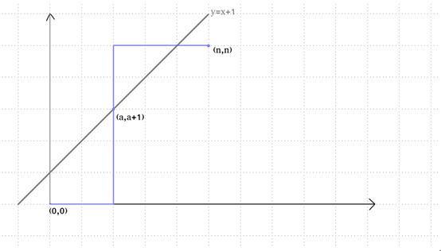
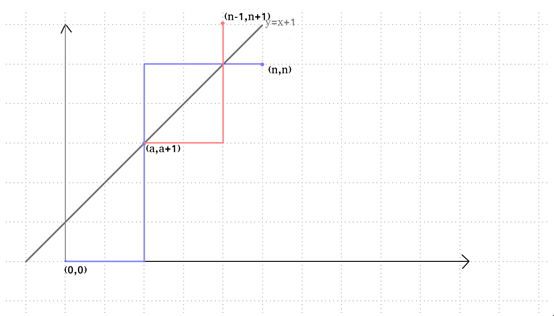

# 数学知识

## 卡特兰数

### 定义

#### 递推定义

$$
f_{n}=f_{0} * f_{n-1}+f_{1} * f n-2+\ldots+f_{n-1} f_{0}, \text { 其中 } n \geq 2
$$

#### 递推关系

$$
f_{n}=\frac{4 n-2}{n+1} f_{n-1}
$$

#### 通项公式

$$
f_{n}=\frac{1}{n+1} C_{2 n}^{n}
$$

经化简后可得
$$
f_{n}=C_{2 n}^{n}-C_{2 n}^{n-1}
$$

### 实际问题

#### 例题 1

在一个*w*×*h*的网格上，你最开始在(0,0)上，你每个单位时间可以向上走一格，或者向右走一格，在任意一个时刻，你往右走的次数都不能少于往上走的次数，问走到(*n*,*m*),0≤*n*

有多少种不同的合法路径。

**合法路径个数为**$C_{2 n}^{n}-C_{2 n}^{n-1}$

直接求不好，考虑求有多少种不合法路径
路径总数为在2*n*次移动中选*n*次向上移动，即$C_{2 n}^{n}$

画一下图，我们把*y*=*x*+1这条线画出来，发现所有的合法路径都是不能碰到这条线的，碰到即说明是一条不合法路径。先随便画一条碰到这条线的不合法路径，所有的不合法路径都会与这条线有至少一个交点，我们把第一个交点设为(*a*,*a*+1)

我们把(*a*,*a*+1)之后的路径全部按照*y*=*x*+1这条线对称过去。这样，最后的终点就会变成(*n*−1,*n*+1)

由于所有的不合法路径一定会与*y*=*x*+1有这么一个交点
 我们可以得出，所有不合法路径对称后都唯一对应着一条到(*n*−1,*n*+1)的路径
 且所有到(*n*−1,*n*+1)的一条路径都唯一对应着一条不合法路径（只需将其对称回去即可）
 所以不合法路径总数是$C_{2 n}^{n-1}$

那么合法的路径总数为$C_{2 n}^{n}-C_{2 n}^{n-1}$

这是一个非常好用且重要的一个方法，其它的问题也可以用该方法解决，即**找到不合法路径唯一对应的到另一个点的路径**

#### 01序列

你现在有*n*

个0和*n*个1，问有多少个长度为2*n*的序列，使得序列的任意一个前缀中1的个数都大于等于0的个数
 例如*n*=2时，有1100,1010两种合法序列，而1001,0101,0110,0011都是不合法的序列

合法的路径总数为$C_{2 n}^{n}-C_{2 n}^{n-1}$

我们把出现一个1看做向右走一格，出现一个1看做向上走一格，那么这个问题就和上面的例题1一模一样了

**拓展**
如果是 *n* 个1, *m* 个 0 呢？
不过是最后的终点变为了(*n*,*m*)罢了 如果是1的个数不能够比*m*少*k*呢？ 我们只需将*y*=*x*+1这条线上下移动即可

#### 括号匹配

你有*n*个左括号，*n*个右括号，问有多少个长度为2*n*的括号序列使得所有的括号都是合法的

#### 进出栈问题

有一个栈，我们有2*n*次操作，*n*次进栈，*n*次出栈，问有多少中合法的进出栈序列

#### 312排列

一个长度为*n*的排列*a*，只要满足$i<j<k$ 且 $a_{j}<a_{k}<a_{i}$就称这个排列为312排列
 求*n*的全排列中不是312排列的排列个数

答案也是卡特兰数

#### 不相交弦问题

在一个圆周上分布着 2*n*个点，两两配对，并在这两个点之间连一条弦，要求所得的2*n*条弦彼此不相交的配对方案数

#### 二叉树的构成问题

有*n*个点，问用这*n*个点最终能构成多少二叉树

#### 凸多边形的三角划分

一个凸的*n*边形，用直线连接他的两个顶点使之分成多个三角形，每条直线不能相交，问一共有多少种划分方案

答案还是卡特兰数列