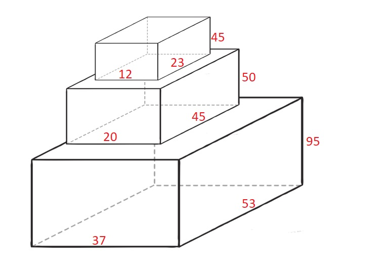

# 第 215 场周赛

`20201213`

## [1688. 比赛中的配对次数](https://leetcode-cn.com/problems/count-of-matches-in-tournament/)

### 题目描述1

给你一个整数 n ，表示比赛中的队伍数。比赛遵循一种独特的赛制：

- 如果当前队伍数是 偶数 ，那么每支队伍都会与另一支队伍配对。总共进行 n / 2 场比赛，且产生 n / 2 支队伍进入下一轮。
- 如果当前队伍数为 奇数 ，那么将会随机轮空并晋级一支队伍，其余的队伍配对。总共进行 (n - 1) / 2 场比赛，且产生 (n - 1) / 2 + 1 支队伍进入下一轮。

返回在比赛中进行的配对次数，直到决出获胜队伍为止。

 

```R
示例 1：

输入：n = 7
输出：6
解释：比赛详情：

- 第 1 轮：队伍数 = 7 ，配对次数 = 3 ，4 支队伍晋级。
- 第 2 轮：队伍数 = 4 ，配对次数 = 2 ，2 支队伍晋级。
- 第 3 轮：队伍数 = 2 ，配对次数 = 1 ，决出 1 支获胜队伍。
  总配对次数 = 3 + 2 + 1 = 6

示例 2：

输入：n = 14
输出：13
解释：比赛详情：

- 第 1 轮：队伍数 = 14 ，配对次数 = 7 ，7 支队伍晋级。
- 第 2 轮：队伍数 = 7 ，配对次数 = 3 ，4 支队伍晋级。 
- 第 3 轮：队伍数 = 4 ，配对次数 = 2 ，2 支队伍晋级。
- 第 4 轮：队伍数 = 2 ，配对次数 = 1 ，决出 1 支获胜队伍。
  总配对次数 = 7 + 3 + 2 + 1 = 13
```

 

提示：

- 1 <= n <= 200

来源：力扣（LeetCode）
链接：https://leetcode-cn.com/problems/count-of-matches-in-tournament
著作权归领扣网络所有。商业转载请联系官方授权，非商业转载请注明出处。

### 解答1

淘汰赛制，一场比赛淘汰一个人，最后只需要 1 个人，所以需要 n - 1 场比赛

```java
class Solution {
    public int numberOfMatches(int n) {
        return n - 1;
    }
}
```

## [1689. 十-二进制数的最少数目](https://leetcode-cn.com/problems/partitioning-into-minimum-number-of-deci-binary-numbers/)

### 题目描述2

如果一个十进制数字不含任何前导零，且每一位上的数字不是 0 就是 1 ，那么该数字就是一个 十-二进制数 。例如，101 和 1100 都是 十-二进制数，而 112 和 3001 不是。

给你一个表示十进制整数的字符串 n ，返回和为 n 的 十-二进制数 的最少数目。


```r
示例 1：

输入：n = "32"
输出：3
解释：10 + 11 + 11 = 32

示例 2：

输入：n = "82734"
输出：8

示例 3：

输入：n = "27346209830709182346"
输出：9
```

提示：

- $1 <= n.length <= 10^5$
- n 仅由数字组成
- n 不含任何前导零并总是表示正整数

来源：力扣（LeetCode）
链接：https://leetcode-cn.com/problems/partitioning-into-minimum-number-of-deci-binary-numbers
著作权归领扣网络所有。商业转载请联系官方授权，非商业转载请注明出处。

### 解答2

找字符串中所有字符最大的。

```java
class Solution {
    public int minPartitions(String n) {
        int res = 0;
        int len = n.length();
        for(int i = 0; i < len; i ++){
            res = Math.max(n.charAt(i) - '0', res);
        }
        return res;
    }
}
```

## [1690. 石子游戏 VII](https://leetcode-cn.com/problems/stone-game-vii/)

### 题目描述3

石子游戏中，爱丽丝和鲍勃轮流进行自己的回合，爱丽丝先开始 。

有 n 块石子排成一排。每个玩家的回合中，可以从行中 移除 最左边的石头或最右边的石头，并获得与该行中剩余石头值之 和 相等的得分。当没有石头可移除时，得分较高者获胜。

鲍勃发现他总是输掉游戏（可怜的鲍勃，他总是输），所以他决定尽力 减小得分的差值 。爱丽丝的目标是最大限度地 扩大得分的差值 。

给你一个整数数组 stones ，其中 stones[i] 表示 从左边开始 的第 i 个石头的值，如果爱丽丝和鲍勃都 发挥出最佳水平 ，请返回他们 得分的差值 。

 ```R
示例 1：

输入：stones = [5,3,1,4,2]
输出：6
解释：
- 爱丽丝移除 2 ，得分 5 + 3 + 1 + 4 = 13 。游戏情况：爱丽丝 = 13 ，鲍勃 = 0 ，石子 = [5,3,1,4] 。
- 鲍勃移除 5 ，得分 3 + 1 + 4 = 8 。游戏情况：爱丽丝 = 13 ，鲍勃 = 8 ，石子 = [3,1,4] 。
- 爱丽丝移除 3 ，得分 1 + 4 = 5 。游戏情况：爱丽丝 = 18 ，鲍勃 = 8 ，石子 = [1,4] 。
- 鲍勃移除 1 ，得分 4 。游戏情况：爱丽丝 = 18 ，鲍勃 = 12 ，石子 = [4] 。
- 爱丽丝移除 4 ，得分 0 。游戏情况：爱丽丝 = 18 ，鲍勃 = 12 ，石子 = [] 。
  得分的差值 18 - 12 = 6 。

示例 2：

输入：stones = [7,90,5,1,100,10,10,2]
输出：122
 ```

提示：

- n == stones.length
- 2 <= n <= 1000
- 1 <= stones[i] <= 1000

来源：力扣（LeetCode）
链接：https://leetcode-cn.com/problems/stone-game-vii
著作权归领扣网络所有。商业转载请联系官方授权，非商业转载请注明出处。

### 解答3

#### yxc 讲解

**博弈论：在最坏情况求最好**


```cpp
class Solution {
public:
    int stoneGameVII(vector<int>& w) {
        int n = w.size();
        vector<int> s(n + 1);
        for (int i = 1; i <= n; i ++ ) s[i] = s[i - 1] + w[i - 1];
        vector<vector<int>> f(n + 1, vector<int>(n + 1));
        for (int len = 2; len <= n; len ++ ) {
            for (int i = 1; i + len - 1 <= n; i ++ ) {
                int j = i + len - 1;
                f[i][j] = max(s[j] - s[i] - f[i + 1][j], s[j - 1] - s[i - 1] - f[i][j - 1]);
            }
        }
        return f[1][n];
    }
};

// 作者：yxc
// 链接：https://www.acwing.com/activity/content/code/content/637510/
// 来源：AcWing
// 著作权归作者所有。商业转载请联系作者获得授权，非商业转载请注明出处。
```
#### Java 解答

```java
class Solution {
    public int stoneGameVII(int[] st) {
        int n = st.length;
        // 构造前缀和
        int[] sub = new int[n + 1];
        for(int i = 1; i <= n; i++) sub[i] = sub[i - 1] + st[i - 1];
        // 区间dp
        // dp[i][j] 在区间[i, j] 先手 - 后手的最大值
        // 分两种情况
        // 拿 i ： dp[i][j] = s(i + 1, j) - dp[i + 1][j];
        // 拿 j ： dp[i][j] = s(i, j - 1) - dp[i][j - 1];
        // 博弈论问题是取各种最坏情况的最大值，所以两者取最大值。
        int[][] dp = new int[n + 1][n + 1];
        for(int len = 2; len <= n; len++){
            for(int i = 1; i + len - 1 <= n; i++){
                int j = i + len - 1;
                dp[i][j] = Math.max(sub[j] - sub[i] - dp[i + 1][j],
                    sub[j - 1] - sub[i - 1] - dp[i][j - 1]);
            }
        }
        // 最后返回所有序列的博弈值
        return dp[1][n];
    }
}
```


## [1691. 堆叠长方体的最大高度](https://leetcode-cn.com/problems/maximum-height-by-stacking-cuboids/)

### 题目描述4

给你 n 个长方体 cuboids ，其中第 i 个长方体的长宽高表示为 cuboids[i] = [widthi, lengthi, heighti]（下标从 0 开始）。请你从 cuboids 选出一个 子集 ，并将它们堆叠起来。

如果 widthi <= widthj 且 lengthi <= lengthj 且 heighti <= heightj ，你就可以将长方体 i 堆叠在长方体 j 上。你可以通过旋转把长方体的长宽高重新排列，以将它放在另一个长方体上。

返回 堆叠长方体 cuboids 可以得到的 最大高度 。

 

```R
示例 1：

输入：cuboids = [[50,45,20],[95,37,53],[45,23,12]]
输出：190
解释：
第 1 个长方体放在底部，53x37 的一面朝下，高度为 95 。
第 0 个长方体放在中间，45x20 的一面朝下，高度为 50 。
第 2 个长方体放在上面，23x12 的一面朝下，高度为 45 。
总高度是 95 + 50 + 45 = 190 。

示例 2：

输入：cuboids = [[38,25,45],[76,35,3]]
输出：76
解释：
无法将任何长方体放在另一个上面。
选择第 1 个长方体然后旋转它，使 35x3 的一面朝下，其高度为 76 。

示例 3：

输入：cuboids = [[7,11,17],[7,17,11],[11,7,17],[11,17,7],[17,7,11],[17,11,7]]
输出：102
解释：
重新排列长方体后，可以看到所有长方体的尺寸都相同。
你可以把 11x7 的一面朝下，这样它们的高度就是 17 。
堆叠长方体的最大高度为 6 * 17 = 102 。
```

提示：

- n == cuboids.length
- 1 <= n <= 100
- 1 <= widthi, lengthi, heighti <= 100

来源：力扣（LeetCode）
链接：https://leetcode-cn.com/problems/maximum-height-by-stacking-cuboids
著作权归领扣网络所有。商业转载请联系官方授权，非商业转载请注明出处。

### 解答4

#### yxc 讲解

```cpp
class Solution {
public:
    int maxHeight(vector<vector<int>>& w) {
        for (auto& x: w) sort(x.begin(), x.end());
        sort(w.begin(), w.end(), greater<vector<int>>());
        int n = w.size();
        vector<int> f(n);

        int res = 0;
        for (int i = 0; i < n; i ++ ) {
            f[i] = w[i][2];
            for (int j = 0; j < i; j ++ )
                if (w[j][0] >= w[i][0] && w[j][1] >= w[i][1] && w[j][2] >= w[i][2]) {
                    f[i] = max(f[i], f[j] + w[i][2]);
                }
            res = max(res, f[i]);
        }

        return res;
    }
};

// 作者：yxc
// 链接：https://www.acwing.com/activity/content/code/content/637543/
// 来源：AcWing
// 著作权归作者所有。商业转载请联系作者获得授权，非商业转载请注明出处。
```

#### Java 讲解

具体证明看 [b 站 y 总讲解]((https://www.bilibili.com/video/BV1ht4y1Y7yD))，这边就记录一下算法思路。

这道题本质上是最长上升子序列问题，不需要关心长方体的哪条边对应长宽高。将每个长方体的三条边从小到大排序，只有对应边都小于，才能叠在一起。

首先进行两次排序

1. 将每个长方体的三边升序排列
2. 将所有长方体三条边升序排列。**因为最优解下，长方体从小到大排列的次序必然是升序排列，所以这一步排序可以保证我们能够得到最优解。**

状态表示：dp[i] 表示以第 i 个长方体为底的最长高度

状态计算：`dp[i] = Math.max(dp[j] + cuboids[i][2], dp[i])`（满足堆叠条件）

```java
class Solution {
    public int maxHeight(int[][] cbs) {
        // 将每个长方体三边从小到大排序
        for(int[] cb : cbs) Arrays.sort(cb);
        Arrays.sort(cbs, (o1, o2) -> {
            if(o1[0] != o2[0]) return o1[0] - o2[0];
            else if(o1[1] != o2[1]) return o1[1] - o2[1];
            else return o1[2] - o2[2];
        });
        // 最长上升子序列思想，找倒数第二与当前是否满足堆叠要求。
        int n = cbs.length;
        int[] dp = new int[n];
        int res = 0;
        for(int i = 0; i < n; i++){
            dp[i] = cbs[i][2];
            for(int j = 0; j < i; j++){
                // 判断是否可以堆叠
                if(cbs[j][0] <= cbs[i][0] && cbs[j][1] <= cbs[i][1] && cbs[j][2] <= cbs[i][2]){
                    dp[i] = Math.max(dp[i], cbs[i][2] + dp[j]);
                }
            }
            // 最长的情况下不一定是以最后一个结尾的
            res = Math.max(res, dp[i]);
        }
        return res;
    }
}
```