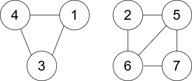

# 第 228 场周赛

`20210214`

## [1758. 生成交替二进制字符串的最少操作数](https://leetcode-cn.com/problems/minimum-changes-to-make-alternating-binary-string/)

### 题目描述1

给你一个仅由字符 '0' 和 '1' 组成的字符串 s 。一步操作中，你可以将任一 '0' 变成 '1' ，或者将 '1' 变成 '0' 。

交替字符串 定义为：如果字符串中不存在相邻两个字符相等的情况，那么该字符串就是交替字符串。例如，字符串 "010" 是交替字符串，而字符串 "0100" 不是。

返回使 s 变成 交替字符串 所需的 最少 操作数。


```r
示例 1：

输入：s = "0100"
输出：1
解释：如果将最后一个字符变为 '1' ，s 就变成 "0101" ，即符合交替字符串定义。

示例 2：

输入：s = "10"
输出：0
解释：s 已经是交替字符串。

示例 3：

输入：s = "1111"
输出：2
解释：需要 2 步操作得到 "0101" 或 "1010" 。
```

**提示**：

- 1 <= s.length <= 104
- s[i] 是 '0' 或 '1'

来源：力扣（LeetCode）
链接：https://leetcode-cn.com/problems/minimum-changes-to-make-alternating-binary-string
著作权归领扣网络所有。商业转载请联系官方授权，非商业转载请注明出处。

### 解答1

```java
class Solution {
    public int minOperations(String s) {
        int n = s.length();
        
        int res1 = 0;
        int res2 = 0;
        // 1 开头
        int t = 1;
        for(int i = 0; i < n; i++) {
            int m = s.charAt(i) - '0';
            if(m != t) res1++;
            t = t ^ 1;
        }
        t = 0;
        for(int i = 0; i < n; i++) {
            int m = s.charAt(i) - '0';
            if(m != t) res2++;
            t = t ^ 1;
        }
        return Math.min(res1, res2);
    }
}
```

## [1759. 统计同构子字符串的数目](https://leetcode-cn.com/problems/count-number-of-homogenous-substrings/)

### 题目描述2

给你一个字符串 s ，返回 s 中 同构子字符串 的数目。由于答案可能很大，只需返回对 109 + 7 取余 后的结果。

同构字符串 的定义为：如果一个字符串中的所有字符都相同，那么该字符串就是同构字符串。

子字符串 是字符串中的一个连续字符序列。

```r
示例 1：

输入：s = "abbcccaa"
输出：13
解释：同构子字符串如下所列：
"a"   出现 3 次。
"aa"  出现 1 次。
"b"   出现 2 次。
"bb"  出现 1 次。
"c"   出现 3 次。
"cc"  出现 2 次。
"ccc" 出现 1 次。
3 + 1 + 2 + 1 + 3 + 2 + 1 = 13

示例 2：

输入：s = "xy"
输出：2
解释：同构子字符串是 "x" 和 "y" 。

示例 3：

输入：s = "zzzzz"
输出：15
```


提示：

- 1 <= s.length <= 105
- s 由小写字符串组成

来源：力扣（LeetCode）
链接：https://leetcode-cn.com/problems/count-number-of-homogenous-substrings
著作权归领扣网络所有。商业转载请联系官方授权，非商业转载请注明出处。

### 解答2

```java
class Solution {
    long mod = 1000000007;
    public int countHomogenous(String s) {
        int n =s.length();
        // int[] a = new int[n + 10];
        long[] sub = new long[n + 10];
        for(int i = 1; i < n + 10; i++) sub[i] = (long)i + sub[i - 1];
        long res = 0;
        for(int i = 0; i < n; ) {
            int j = i;
            int tmp = 0;
            while(j < n && s.charAt(j) == s.charAt(i)) j++;
            tmp = j - i;
            res = (res + sub[tmp] % mod) % mod;
            i = j;
        }
        return (int) res;
    }
}
```

## [1760. 袋子里最少数目的球](https://leetcode-cn.com/problems/minimum-limit-of-balls-in-a-bag/)

### 题目描述3

给你一个整数数组 nums ，其中 nums[i] 表示第 i 个袋子里球的数目。同时给你一个整数 maxOperations 。

你可以进行如下操作至多 maxOperations 次：

- 选择任意一个袋子，并将袋子里的球分到 2 个新的袋子中，每个袋子里都有 正整数 个球。
  - 比方说，一个袋子里有 5 个球，你可以把它们分到两个新袋子里，分别有 1 个和 4 个球，或者分别有 2 个和 3 个球。

你的开销是单个袋子里球数目的 最大值 ，你想要 最小化 开销。

请你返回进行上述操作后的最小开销。


```r
示例 1：

输入：nums = [9], maxOperations = 2
输出：3
解释：
- 将装有 9 个球的袋子分成装有 6 个和 3 个球的袋子。[9] -> [6,3] 。
- 将装有 6 个球的袋子分成装有 3 个和 3 个球的袋子。[6,3] -> [3,3,3] 。
装有最多球的袋子里装有 3 个球，所以开销为 3 并返回 3 。

示例 2：

输入：nums = [2,4,8,2], maxOperations = 4
输出：2
解释：
- 将装有 8 个球的袋子分成装有 4 个和 4 个球的袋子。[2,4,8,2] -> [2,4,4,4,2] 。
- 将装有 4 个球的袋子分成装有 2 个和 2 个球的袋子。[2,4,4,4,2] -> [2,2,2,4,4,2] 。
- 将装有 4 个球的袋子分成装有 2 个和 2 个球的袋子。[2,2,2,4,4,2] -> [2,2,2,2,2,4,2] 。
- 将装有 4 个球的袋子分成装有 2 个和 2 个球的袋子。[2,2,2,2,2,4,2] -> [2,2,2,2,2,2,2,2] 。
装有最多球的袋子里装有 2 个球，所以开销为 2 并返回 2 。

示例 3：

输入：nums = [7,17], maxOperations = 2
输出：7
```


提示：

- 1 <= nums.length <= 105
- 1 <= maxOperations, nums[i] <= 109

来源：力扣（LeetCode）
链接：https://leetcode-cn.com/problems/minimum-limit-of-balls-in-a-bag
著作权归领扣网络所有。商业转载请联系官方授权，非商业转载请注明出处。

### 解答3

```java
class Solution {
    public int minimumSize(int[] nums, int maxOperations) {
        int n = nums.length;
        int low = 1, high = 1000000000;
        int res = Integer.MAX_VALUE;
        while(low <= high) {
            int mid = (low + high) >> 1;
            if(check(mid, nums, maxOperations)) {
                high = mid - 1;
                res = Math.min(res, mid);
            }
            else {
                low = mid + 1;
            }
        }
        return res;
    }
    public boolean check(int mid, int[] nums, int maxOperations) {
        int t = 0;
        for(int i = 0; i < nums.length; i++) {
            t = t + (nums[i] + mid - 1) / mid - 1;
        }
        return t <= maxOperations;
    }
}
```


## [1761. 一个图中连通三元组的最小度数](https://leetcode-cn.com/problems/minimum-degree-of-a-connected-trio-in-a-graph/)

### 题目描述4

给你一个无向图，整数 n 表示图中节点的数目，edges 数组表示图中的边，其中 edges[i] = [ui, vi] ，表示 ui 和 vi 之间有一条无向边。

一个 连通三元组 指的是 三个 节点组成的集合且这三个点之间 两两 有边。

连通三元组的度数 是所有满足此条件的边的数目：一个顶点在三元组内，而另一个顶点不在三元组内。

请你返回所有连通三元组中度数的 最小值 ，如果图中没有连通三元组，那么返回 -1 。

 

示例 1：


```r
输入：n = 6, edges = [[1,2],[1,3],[3,2],[4,1],[5,2],[3,6]]
输出：3
解释：只有一个三元组 [1,2,3] 。构成度数的边在上图中已被加粗。
```
示例 2：


```r
输入：n = 7, edges = [[1,3],[4,1],[4,3],[2,5],[5,6],[6,7],[7,5],[2,6]]
输出：0
解释：有 3 个三元组：
1) [1,4,3]，度数为 0 。
2) [2,5,6]，度数为 2 。
3) [5,6,7]，度数为 2 。
```

**提示**：

- 2 <= n <= 400
- edges[i].length == 2
- 1 <= edges.length <= n * (n-1) / 2
- 1 <= ui, vi <= n
- ui != vi
- 图中没有重复的边。


来源：力扣（LeetCode）
链接：https://leetcode-cn.com/problems/minimum-degree-of-a-connected-trio-in-a-graph
著作权归领扣网络所有。商业转载请联系官方授权，非商业转载请注明出处。

### 解答4

```java
class Solution {
    public int minTrioDegree(int n, int[][] edges) {
        int[] d = new int[n + 1];
        boolean[] st = new boolean[1000000];
        for(int[] edge : edges) {
            int a = edge[0], b = edge[1];
            d[a]++;
            d[b]++;
            // a * 1000 + b 代表 a b 之间有边
            st[a * 1000 + b] = true;
            st[b * 1000 + a] = true;
        }
        // 三重循环
        int res = Integer.MAX_VALUE;
        for(int i = 1; i <= n; i ++) {
            for(int j = i + 1; j <= n; j++) {
                if(st[i * 1000 + j]) {
                    for(int k = j + 1; k <= n; k++) {
                        if(st[i * 1000 + k] && st[j * 1000 + k]) {
                            res = Math.min(res, d[i] + d[j] + d[k] - 6);
                        }
                    }
                }
            }
        }
        if(res == Integer.MAX_VALUE) return -1;
        return res;
    }
}
```

